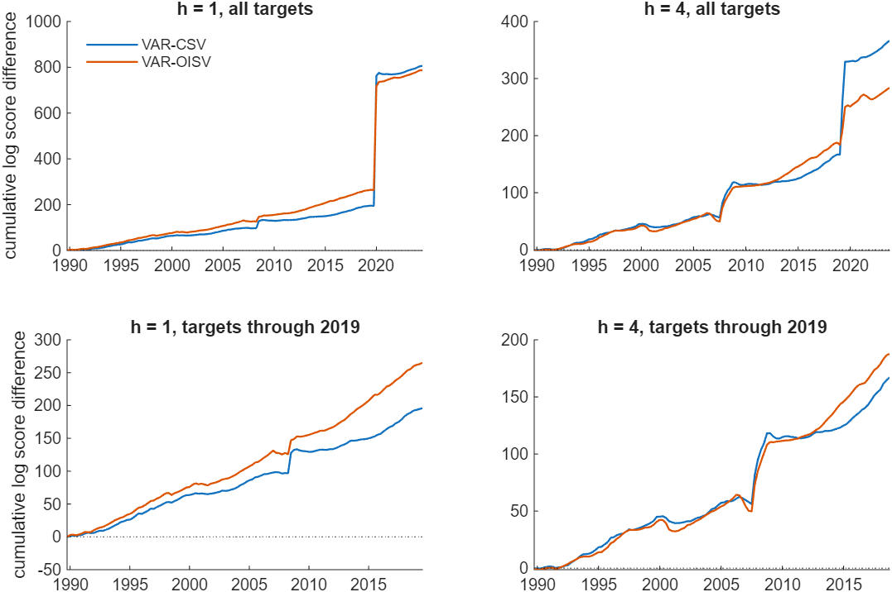
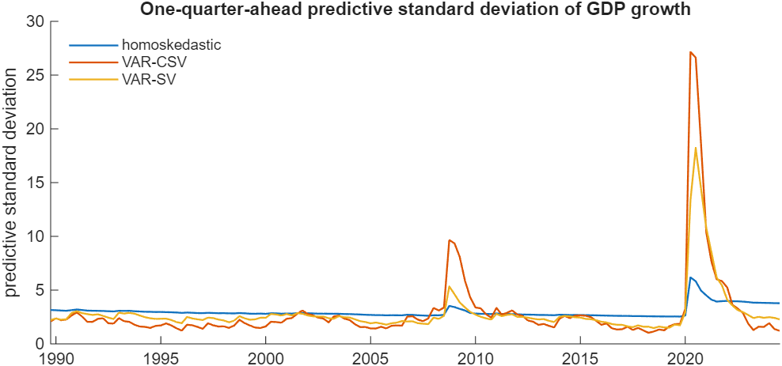
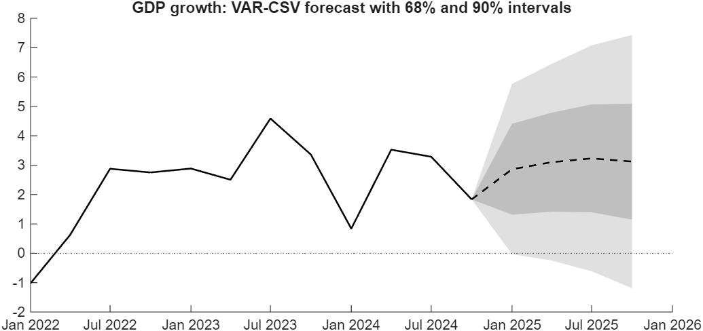

# Does Modeling the Volatility Improve My Forecasts?

*Code: [`build.m`](build.m) and [`your_data.m`](your_data.m), which call
[`bvar.models.var_csv`](../../core/+bvar/+models/var_csv.m),
[`bvar.models.var_sv`](../../core/+bvar/+models/var_sv.m),
[`bvar.forecast.simulate`](../../core/+bvar/+forecast/simulate.m) and
[`bvar.forecast.mixquantile`](../../core/+bvar/+forecast/mixquantile.m). Method:
[Carriero, Clark and Marcellino (2016)](../../CITING.md#carriero-clark-and-marcellino-2016),
[Chan (2020)](../../CITING.md#chan-2020a) and
[Chan, Koop and Yu (2024)](../../CITING.md#chan-koop-and-yu-2024).*

In this tutorial we forecast the five quarterly US series of [the volatility-specification
tutorial](../sv_specification/), recursively and out of sample, from three reduced-form BVARs: a
homoskedastic one, one with a common volatility factor, and one with a volatility process per
equation. Each is re-estimated at every forecast origin and scored two ways: by the root mean
squared forecast error (RMSFE) of its point forecast, and by the log predictive likelihood of the
realized value under its whole predictive density.

Over 140 forecasts from 1990 both volatility models improve on the homoskedastic benchmark by both
criteria. The density gains are largest for the pandemic quarters and are not confined to them: 24
and 34 percent of the one-quarter-ahead gain and 46 and 66 percent of the four-quarter-ahead gain
come from quarters before 2020. The predictive intervals show why. A homoskedastic VAR is too wide
in calm years and far too narrow in a crisis.

## Try It Now

Five commands, from the root of the repository:

| Command | What it produces | Time |
|---|---|---|
| `run tutorials/forecasting/your_data.m` | the same comparison over a short window with short chains | about a minute |
| `run tutorials/forecasting/forecast_now.m` | a forecast of the quarters after the sample, with intervals and an event probability | about a minute |
| `run tutorials/forecasting/bench_density.m` | the two ways of scoring a multi-step density, on identical draws | about a minute |
| `run tutorials/forecasting/check_stability.m` | the same quantities from chains of other seeds and four times the length | ten minutes |
| `run tutorials/forecasting/build.m` | every number and figure on this page | 23 minutes |

This workflow needs MATLAB with the Statistics and Machine Learning Toolbox.



*Figure 1: The running sum of the joint log predictive likelihood of each volatility model minus
that of the homoskedastic VAR, against the quarter in which the forecast is made. A rising line
indicates the more accurate model. The top row uses every forecast; the bottom row keeps only
those whose target quarter falls before 2020, and the vertical scales differ across panels.*

## The Three Models

All three are reduced-form VARs with four lags. The first is homoskedastic, with
$`\mathbf{u}_t \sim N(\mathbf{0}, \mathbf{\Sigma})`$ under the natural conjugate prior. The second
is VAR-CSV,

```math
\mathbf{u}_t \sim N(\mathbf{0}, \mathrm{e}^{h_t}\mathbf{\Sigma}), \qquad
h_t = \phi h_{t-1} + \varepsilon_t,
```

where the mean of $`h_t`$ is fixed at zero, so that $`\mathbf{\Sigma}`$ carries the scale of the
errors and one factor scales the whole matrix. This is the common stochastic volatility of
Carriero, Clark and Marcellino (2016), under the same prior as the first model, estimated by the
algorithm of Chan (2020), whose volatility step is the accept-reject Metropolis-Hastings of Chan
(2017). The third is VAR-OISV, with one log-volatility per equation and the order-invariant impact
matrix of Chan, Koop and Yu (2024), under that paper's Minnesota-type horseshoe prior, whose
own-lag and cross-lag shrinkage are estimated.

None of the three depends on the order of the columns, which is the subject of [the ordering
tutorial](../variable_ordering/). The first two share the natural conjugate prior, so the
difference between them is the volatility model alone. The third uses the Minnesota-type horseshoe
prior, so that comparison is between whole model-prior configurations.

Each model is estimated from 5,000 draws after a burn-in period of 1,000 and forecast one to four
quarters ahead. The log predictive likelihood of a realized value is the log of the average of its
predictive density over those draws.

## The Data and the Forecast Target

The five quarterly series are read from [`macro5_Q.csv`](../sv_specification/macro5_Q.csv) in the
folder of [the volatility-specification tutorial](../sv_specification/), 1971Q1 to 2024Q4:

| Series | Units |
|---|---|
| Unemployment rate | percent |
| PCE inflation | annualized quarterly rate, percent |
| Federal funds rate | percent |
| Chicago Fed National Financial Conditions Index | index, positive values indicating tighter conditions than average |
| Real GDP growth | annualized quarterly rate, percent |

With four lags and eight initial conditions, the first estimation sample ends in 1989Q4 and the
first forecast is of 1990Q1. Every model at every origin uses the data up to that quarter in the
current vintage, so the exercise is pseudo-out-of-sample.

## How the Densities Are Computed

For the homoskedastic VAR the $`h`$-step predictive distribution is Gaussian in closed form, and
[`bvar.forecast.predictive`](../../core/+bvar/+forecast/predictive.m) returns its mean and variance
for each draw. When the covariance varies over time no closed form is available, since the
covariance at $`T+h`$ is unknown at $`T`$, and the density must be simulated. Two estimators are
available.

The first simulates a whole path of the data for each draw and evaluates the realized value at the
state that path reaches. It is the noisier of the two, because few simulated paths land near an
extreme realized value, so the average that results is determined by a small number of draws.

`bvar.forecast.simulate` implements the second. Only the volatility path is simulated; given that
path the $`h`$-step distribution is Gaussian, with the mean iterating the VAR and the variance

```math
\mathbf{V}_h = \sum_{i=0}^{h-1} \mathbf{\Psi}_i \mathbf{\Sigma}_{T+h-i} \mathbf{\Psi}_i',
```

where $`\mathbf{\Psi}_i`$ are the moving-average matrices of the VAR. The density is therefore
evaluated exactly and only the volatility is integrated by Monte Carlo. The predictive
distribution that results is a mixture: conditioning on the coefficients and the volatility path
gives a normal, and the average of those normals over the draws has heavier tails than any one
of them.

[`bench_density.m`](bench_density.m) compares the two on identical posterior draws. Beyond one
quarter the path-based estimator returns a lower score and a wider spread across simulation seeds,
and both gaps are largest where the realized value is extreme: at the pandemic origin, four
quarters ahead, it gives −19.83 against −18.28, with seed ranges of 1.30 against 0.32. A
multi-step density score that changes materially between seeds usually has this cause.

As an implementation check the build also scores the homoskedastic model both ways, by simulation
and in closed form; the two agree to `0.0000` at both horizons.

## Accuracy Relative to the Homoskedastic VAR

There are 140 forecasts at one quarter ahead and 137 at four, since the last three origins
have no realized value four quarters ahead.

*Table 1: Accuracy relative to the homoskedastic VAR. The RMSFE column reports the median
percentage gain across the five variables; the log score column reports the mean gain in the joint
log predictive likelihood, per quarter.*

| Model | Horizon | Group | Forecasts | RMSFE gain | Log score gain |
|---|---|---|---|---|---|
| VAR-CSV | 1 | all | 140 | 4.9% | 5.76 |
| | 1 | targets through 2019 | 120 | 5.1% | 1.63 |
| | 1 | targets 2020 onwards | 20 | −0.9% | 30.50 |
| VAR-CSV | 4 | all | 137 | 5.0% | 2.68 |
| | 4 | targets through 2019 | 117 | 13.5% | 1.43 |
| | 4 | targets 2020 onwards | 20 | −0.0% | 9.98 |
| VAR-OISV | 1 | all | 140 | 8.5% | 5.62 |
| | 1 | targets through 2019 | 120 | 3.7% | 2.21 |
| | 1 | targets 2020 onwards | 20 | 22.6% | 26.11 |
| VAR-OISV | 4 | all | 137 | 17.6% | 2.07 |
| | 4 | targets through 2019 | 117 | 20.4% | 1.61 |
| | 4 | targets 2020 onwards | 20 | 8.7% | 4.81 |

The density gains are largest for pandemic targets, by a factor of twenty at one quarter and of
four to seven at four quarters. They are not confined to those quarters: multiplying each block's
mean by its count, the calm block accounts for 24 percent of VAR-CSV's total one-quarter gain and
34 percent of VAR-OISV's, and 46 and 66 percent of the four-quarter gains.

The two volatility models also separate by period. For targets through 2019 VAR-OISV has the
larger density gain at both horizons, 2.21 against 1.63 at one quarter and 1.61 against 1.43 at
four, and it is ahead in 90 of those 120 quarters at one quarter and in 67 of the 117 at four.
For targets from 2020 the order reverses, VAR-CSV ahead by 30.50 against 26.11 at one quarter
and 9.98 against 4.81 at four. At one quarter that
reversal comes from a single quarter: VAR-CSV scores 114 log points above VAR-OISV in 2020Q2 and
is 26 log points behind over the other nineteen. At four quarters it is broader, 69 log points
from 2020Q2 and 35 from the rest of the block.

The predictive intervals account for the difference. One factor scales all five variances by the
same number, and it moves further in both directions than five separate volatilities do: the
VAR-CSV predictive standard deviation of GDP growth peaks at 27.2 in 2020Q2 against VAR-OISV's
18.2 in 2020Q3, while its median through 2019 is 2.05 against 2.36. A wider band raises the
predictive density at an extreme realized value and lowers it at an ordinary one.

The point forecasts follow close to the opposite pattern. Most of the RMSFE gain is earned in calm
quarters, 13.5 and 20.4 percent at four quarters, while for pandemic targets VAR-CSV is no more
accurate than the benchmark at either horizon and only VAR-OISV improves on it, by 22.6 percent at
one quarter.

*Table 2: Accuracy by variable, against the homoskedastic VAR. The RMSFE column is the percentage
gain in root mean squared forecast error and the score column the mean gain in that variable's own
log predictive likelihood, so the five do not add up to the joint gain of Table 1.*

| Horizon | Variable | VAR-CSV RMSFE | VAR-CSV score | VAR-OISV RMSFE | VAR-OISV score |
|---|---|---|---|---|---|
| 1 | Unemployment | −0.2% | 3.73 | −5.7% | 2.82 |
| 1 | PCE inflation | 2.7% | 0.23 | 7.9% | 0.18 |
| 1 | Fed funds | 13.2% | 0.57 | 44.6% | 0.95 |
| 1 | NFCI | 19.3% | 0.63 | 38.4% | 0.99 |
| 1 | GDP growth | 4.9% | 0.56 | 8.5% | 0.56 |
| 4 | Unemployment | −3.3% | 0.67 | −10.2% | 0.55 |
| 4 | PCE inflation | 16.3% | 0.30 | 17.6% | 0.25 |
| 4 | Fed funds | 5.0% | 0.18 | 18.6% | 0.23 |
| 4 | NFCI | 21.4% | 0.46 | 31.3% | 0.63 |
| 4 | GDP growth | 2.6% | 0.59 | 3.4% | 0.42 |

The median reported in Table 1 summarizes a wide spread. The point-forecast gains come from the
financial and policy series: at one quarter, 13.2 and 44.6 percent for the federal funds rate and
19.3 and 38.4 percent for the NFCI, against 2.7 and 7.9 percent for inflation. Unemployment is the
one series both volatility models forecast less accurately than the benchmark, by 0.2 and 5.7
percent at one quarter and by 3.3 and 10.2 percent at four. Its density gain at one quarter, 3.73
for VAR-CSV, is the largest of any variable at either horizon. For that series the volatility
models improve the interval and leave the point forecast slightly worse.

Over all 140 forecasts the two criteria select different models: VAR-CSV has the larger log score
gain at both horizons and VAR-OISV the larger RMSFE gain.

## The Predictive Intervals



*Figure 2: One-quarter-ahead predictive standard deviation of GDP growth at each origin.*

*Table 3: Median one-quarter-ahead predictive standard deviation of GDP growth, by the quarter
forecast.*

| Model | Targets through 2019 | Targets 2020 onwards |
|---|---|---|
| Homoskedastic | 2.80 | 3.93 |
| VAR-CSV | 2.05 | 3.27 |
| VAR-OISV | 2.36 | 3.05 |

The homoskedastic VAR has the widest interval in both blocks. It fits one covariance matrix to
thirty years, so its density is too diffuse in calm quarters, which costs log points in most of
them, and far too tight in 2020, which costs a large number at once. Its interval does widen after
2020, from 2.80 to 3.93, because the pandemic observations enter the estimation sample and remain
in it.

*Table 4: Coverage of the predictive intervals for GDP growth and inflation, and their average
width, over all 140 forecasts at one quarter and 137 at four. A well calibrated 80 percent
interval covers 80 percent of the realized values.*

| Variable | Horizon | Model | 80% coverage | 80% width | 95% coverage | 95% width |
|---|---|---|---|---|---|---|
| GDP growth | 1 | Homoskedastic | 87% | 7.67 | 97% | 11.76 |
| GDP growth | 1 | VAR-CSV | 76% | 6.95 | 93% | 11.72 |
| GDP growth | 1 | VAR-OISV | 83% | 6.79 | 94% | 11.34 |
| PCE inflation | 1 | Homoskedastic | 87% | 3.84 | 95% | 5.89 |
| PCE inflation | 1 | VAR-CSV | 79% | 3.73 | 96% | 6.30 |
| PCE inflation | 1 | VAR-OISV | 84% | 3.37 | 96% | 5.55 |
| GDP growth | 4 | Homoskedastic | 86% | 8.40 | 96% | 12.91 |
| GDP growth | 4 | VAR-CSV | 82% | 7.99 | 96% | 14.74 |
| GDP growth | 4 | VAR-OISV | 82% | 7.05 | 95% | 12.21 |
| PCE inflation | 4 | Homoskedastic | 80% | 5.58 | 94% | 8.63 |
| PCE inflation | 4 | VAR-CSV | 84% | 5.22 | 96% | 9.34 |
| PCE inflation | 4 | VAR-OISV | 82% | 4.71 | 94% | 7.78 |

With 140 forecasts the standard error of a coverage rate near 80 percent is about 3 percentage
points, so differences of a few points carry little information, and the forecasts are not
independent. One comparison is larger than that. The homoskedastic 80 percent interval for GDP
growth covers 87 percent of the realized values at one quarter, two standard errors above its
nominal level, and it is also the widest of the three, 7.67 against 6.79 for VAR-OISV. Both
volatility models reach a coverage nearer the nominal level with a narrower interval, which is
what the log scores in Table 1 reward.

## Forecasts Beyond the End of the Sample

The exercise above stops before the last observation, so that every forecast has a realized value
to be evaluated against. [`forecast_now.m`](forecast_now.m) estimates all three models through the
final quarter of the sample and reports their forecasts for the quarters ahead.



*Figure 3: Forecast of GDP growth for 2025 from VAR-CSV, estimated through 2024Q4. The dashed line
denotes the posterior median and the shaded areas the 68 and 90 percent predictive intervals.*

[`bvar.forecast.mixquantile`](../../core/+bvar/+forecast/mixquantile.m) inverts the predictive
mixture for the intervals, and the probability of an event is its cdf at the threshold:

```matlab
p = mean(normcdf((0 - mu)./sd));      % predictive probability of a fall below zero
```

where `mu` and `sd` are the columns `bvar.forecast.simulate` returns for that variable and
horizon. Fitting one normal to the mixture's mean and variance, or taking quantiles of the draws'
means, would both understate the uncertainty.

*Table 5: Probability that quarterly GDP growth is negative, estimated through 2024Q4. The target
is the annualized growth rate of each quarter.*

| Model | 2025Q1 | 2025Q2 | 2025Q3 | 2025Q4 |
|---|---|---|---|---|
| Homoskedastic | **32%** | 28% | 29% | 31% |
| VAR-CSV | **5%** | 6% | 7% | 9% |
| VAR-OISV | 9% | 12% | 12% | 12% |

The three models' medians for 2025Q1 are close together, at 1.7, 2.9 and 3.0 percent, and what
differs is the width. The homoskedastic 90 percent interval for GDP growth is [−4.5, 7.9] against
VAR-CSV's [−0.0, 5.8], because a single covariance matrix fitted to 1971 through 2024 still
reflects 2020 five years later.

The script writes the forecasts and the event probabilities to `outdir`, which defaults to
`tempdir`. The event and the variable drawn in the fan chart are settings at the top of it.

## Checking the Estimates

Both chains are re-run at every origin, so their mixing matters. At the last origin, from 5,000
draws with a bandwidth of 200, the inefficiency factors are 8, 23 and 62 for VAR-CSV's
persistence, its volatility variance and $`\Sigma_{11}`$, and 21, 62 and 12 for VAR-OISV's first
persistence, its first volatility variance and the log-volatility at the end of the sample.
Section 6.5 of *Bayesian Macroeconometrics* sets out the diagnostic, and
[ex13](../../examples/ex13_mcmc_diagnostics.m) applies it in detail.

An inefficiency factor describes the draws at one origin. Whether the numbers on this page would
come out the same from another chain is a separate question, and
[`check_stability.m`](check_stability.m) measures it: at four origins, two ordinary, one just
before the pandemic and one inside it, each volatility model is estimated three times at the
build's settings under different seeds and once at four times the length. Over those sixteen
comparisons the three seeds spread the joint log score by at most 0.23 log points at one quarter
and 0.55 at four, a chain of 20,000 draws differs from one of 5,000 at the same seed by at most
0.38, and the predictive probability that GDP growth is negative moves by at most half a
percentage point. The model differences reported above are 1.4 to 30 log points a quarter, so
5,000 draws resolve them.

## Applying the Method to Your Data

The script [`your_data.m`](your_data.m) runs the same comparison on any dataset. Set the file, the
columns, the lag length, the evaluation window and the chain lengths in its settings block. The
loop is three calls per origin:

```matlab
res = bvar.models.var_csv(Y0, Y, p, 'nsim', nsim, 'burnin', burnin, 'draws', true);
dr = struct('A', reshape(res.draws.A(d,:), k, n), 'Sig', reshape(res.draws.Sig(d,:), n, n), ...
            'h_T', res.draws.h(d,end), 'phi', res.draws.phi(d), 'sigh2', res.draws.sigh2(d));
[yhat, lden, ljoint] = bvar.forecast.simulate('csv', dr, cfg);
```

where `cfg` holds the last `p` observations, the longest horizon and the realized value.
`bvar.models.var_sv` returns the same shape of draws for the order-invariant model, with `impact`,
`h_T`, `phi` and `sig2` in place of the common factor's fields, and `simulate` takes `'oisv'` for
it. The script writes the scores to `outdir`, which defaults to `tempdir`.

## Reproducing the Results

To reproduce all results on this page, run the build script from the root of the repository:

```matlab
run tutorials/forecasting/build.m
```

The computation takes 23.0 minutes using MATLAB R2025b on a computer with an Intel Core Ultra 7
255U processor and 32 GB of RAM. The script prints every result on this page, or the numbers they
are computed from, and saves the figures in the same folder. The scores of every individual
forecast, with the quarter in which it is made and the quarter it is for, are in
`scores_by_origin.mat`, so that a regrouping or a question about a single quarter requires no
rerun. Neither [`bench_density.m`](bench_density.m) nor [`check_stability.m`](check_stability.m)
is part of the build.

## References

Carriero, A., Clark, T. E. and Marcellino, M. (2016). Common drifting volatility in large Bayesian
VARs. *Journal of Business and Economic Statistics*, 34(3): 375-390.

Chan, J. C. C. (2017). The stochastic volatility in mean model with time-varying parameters: an
application to inflation modeling. *Journal of Business and Economic Statistics*, 35(1): 17-28.

Chan, J. C. C. (2020). Large Bayesian VARs: a flexible Kronecker error covariance structure.
*Journal of Business and Economic Statistics*, 38(1): 68-79.

Chan, J. C. C. (2023). Comparing stochastic volatility specifications for large Bayesian VARs.
*Journal of Econometrics*, 235(2): 1419-1446.

Chan, J. C. C., Koop, G. and Yu, X. (2024). Large order-invariant Bayesian VARs with stochastic
volatility. *Journal of Business and Economic Statistics*, 42(2): 825-837.
