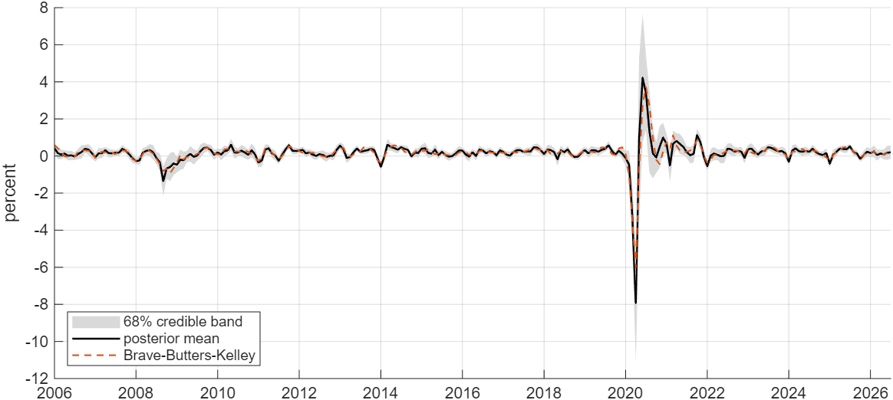
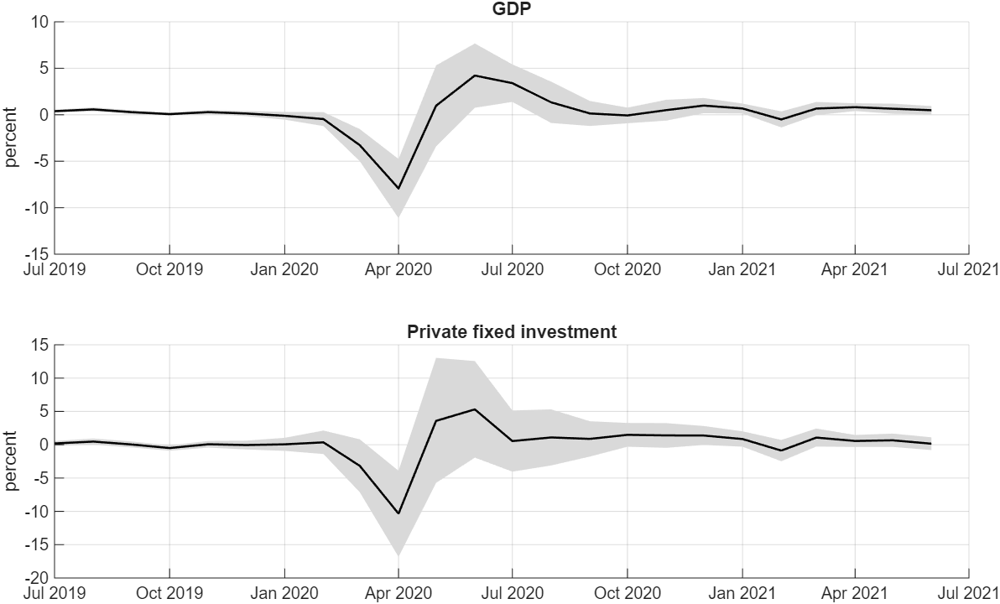

# How Do I Handle Missing and Mixed-Frequency Data in My VAR?

*Code: [`build.m`](build.m) and [`your_data.m`](your_data.m), which call
[`bvar.models.mfvar_csv`](../../core/+bvar/+models/mfvar_csv.m),
[`bvar.samplers.missing_var`](../../core/+bvar/+samplers/missing_var.m) and
[`bvar.util.mm_constraint`](../../core/+bvar/+util/mm_constraint.m). Method:
[Chan, Poon and Zhu (2023)](../../CITING.md#chan-poon-and-zhu-2023),
[Schorfheide and Song (2015)](../../CITING.md#schorfheide-and-song-2015) and
[Chan (2020)](../../CITING.md#chan-2020a).*

In this tutorial we estimate a VAR on data with three kinds of missing values: series published
only quarterly, values that were never published, and the months at the end of the sample that no
quarterly value covers yet. The quarterly series are US real GDP and real private fixed
investment. Following Schorfheide and Song (2015), the VAR is specified at the monthly frequency,
and the monthly values of each quarterly series are treated as missing data, tied to the published
quarterly growth rates by the log-linear aggregation of Mariano and Murasawa (2003). Given the
parameters, the missing values are jointly Gaussian with a banded precision matrix, so Chan, Poon
and Zhu (2023) draw all of them in one block. We use the model and priors of their first
application, a VAR with common stochastic volatility, on five monthly FRED-MD series and the two
quarterly series from 1959 to 2026.

Monthly GDP falls by 7.92 percent in April 2020, with a 90% credible band from −13.3 to −2.8
percent, and grows by 4.22 percent in June (Table 1). Over 1960 to 2026 the estimated monthly
growth rates have a correlation of 0.93 with the Brave-Butters-Kelley series, which comes from a
collapsed dynamic factor model (Figure 1). The same draw fills in the values that were never
published: the unemployment rate for October 2025 is estimated at 4.43 percent.

## Try It Now

Two commands, from the root of the repository:

| Command | What it produces | Time |
|---|---|---|
| `run tutorials/mixed_frequency/your_data.m` | the same model from 1990 with short chains, the monthly estimates of GDP and investment, and a report | about a minute |
| `run tutorials/mixed_frequency/build.m` | every number and figure on this page | about 25 minutes |

This workflow needs MATLAB with the Statistics and Machine Learning Toolbox.



*Figure 1: Monthly growth of US real GDP, 100 times the log change, 2006:01–2026:07: the posterior
mean (black) and 68% credible band (gray) from the mixed-frequency VAR, and the
Brave-Butters-Kelley series (orange, dashed), divided by 12 to put its annualized rate in the same
units.*

## Monthly Values as Missing Data

Stack the monthly observations of the $`n`$ variables as
$`\mathbf{y} = (\mathbf{y}_1', \ldots, \mathbf{y}_T')'`$. Some of its elements are missing, and
Chan, Poon and Zhu (2023) write

```math
\mathbf{y} = \mathbf{S}_o\mathbf{y}^o + \mathbf{S}_m\mathbf{y}^m,
```

where $`\mathbf{y}^o`$ and $`\mathbf{y}^m`$ collect the observed and missing values and the
selection matrices $`\mathbf{S}_o`$ and $`\mathbf{S}_m`$ pick them out
(`bvar.util.select_obs`). The monthly values of a quarterly series are missing in every month.
Its quarterly growth rate $`z_t`$, 100 times the log change, is tied to the monthly growth rates
of the last five months by the approximation of Mariano and Murasawa (2003),

```math
z_t = \tfrac{1}{3}\left(y_t + 2y_{t-1} + 3y_{t-2} + 2y_{t-3} + y_{t-4}\right),
```

where $`t`$ is the last month of the quarter. Stacked over the quarters, these restrictions read
$`\mathbf{M}\mathbf{y} = \mathbf{z}`$ (`bvar.util.mm_constraint`).

The VAR is

```math
\mathbf{y}_t = \mathbf{b}_0 + \mathbf{B}_1\mathbf{y}_{t-1} + \cdots + \mathbf{B}_p\mathbf{y}_{t-p}
+ \boldsymbol{\varepsilon}_t, \qquad
\boldsymbol{\varepsilon}_t \sim N(\mathbf{0}, \mathrm{e}^{h_t}\mathbf{\Sigma}),
```

where the log-volatility $`h_t`$ follows a stationary AR(1) process with mean zero, the common
stochastic volatility of Carriero, Clark and Marcellino (2016). Given the parameters and the
volatility path, the missing values are jointly Gaussian, and their precision matrix is banded,
because $`\mathbf{y}_t`$ enters only the equations of months $`t`$ to $`t+p`$. The sampler draws
all of them from one Cholesky factor of that matrix and then imposes
$`\mathbf{M}\mathbf{y} = \mathbf{z}`$ exactly (`bvar.samplers.missing_var`). Given the completed
data, the remaining parameters are drawn as in a VAR without missing data: the coefficients
jointly from their Gaussian conditional distribution, $`\mathbf{\Sigma}`$ from its inverse-Wishart
conditional distribution, and the volatility path and its parameters following the approach of
Chan (2020).

We use the priors of Chan, Poon and Zhu (2023). The coefficients have independent normal priors
centered at zero, with variance $`\kappa_1/l^2`$ on the own lag $`l`$,
$`\kappa_2 s_i^2/(l^2 s_j^2)`$ on lag $`l`$ of variable $`j`$ in equation $`i`$ and $`100 s_i^2`$
on the intercept, where $`\kappa_1 = 0.04`$, $`\kappa_2 = 0.01`$ and $`s_i^2`$ is the residual
variance of an AR(4) model for variable $`i`$. The error covariance matrix has the prior
$`\mathbf{\Sigma} \sim IW(n+3, \mathbf{I}_n)`$ and the variance of the volatility innovations the
prior $`\sigma_h^2 \sim IG(10, 0.004)`$. The paper gives the AR coefficient $`\phi`$ a normal
prior truncated to $`|\phi| < 1`$ without its mean and variance; we set them to 0.98 and
$`0.05^2`$, the values of the common-volatility model elsewhere in this repository. The paper does
not say how $`s_i^2`$ is computed for a series with no monthly values; for a quarterly series we
set it to 9/19 of the residual variance of an AR(4) model for its quarterly growth rates, because
under the aggregation above, independent monthly growth rates with variance $`\sigma^2`$ give
quarterly growth rates with variance $`19\sigma^2/9`$.

The volatility path is drawn in blocks of 36 months, each from its conditional distribution given
the rest of the path, with the accept-reject Metropolis-Hastings step of Chan (2017)
(`bvar.sv.csv_armh_block`). On this sample, 95.5% of the proposals for a block of 36 months are
accepted, against 0.7% of the proposals for the whole path of 798 months in one step.

## Data

The five monthly series and their transformations are those of the paper: industrial production,
the CPI and payroll employment in 100 times log changes, the unemployment rate in levels, and
average weekly hours in manufacturing divided by 10. They come from the August 2026 vintage of
FRED-MD (McCracken and Ng, 2016). Real GDP and real private fixed investment come from the FRED-QD
vintage of the same month (McCracken and Ng, 2021) and enter as 100 times their quarterly log
changes. The sample runs from 1959:02 to 2026:07, and the VAR has twelve lags, so the first twelve
months serve as initial conditions.

Three monthly values are also missing. The Bureau of Labor Statistics published no CPI and no
unemployment rate for October 2025, during the federal government shutdown. The unemployment rate
for October is a missing value like any other. With the CPI missing for one month, the monthly
inflation rates of October and November are both missing, but their sum is known from the
published index, and it enters as one more row of $`\mathbf{M}\mathbf{y} = \mathbf{z}`$
(`bvar.util.dlog_gaps`). The data end in July 2026, the first month of a quarter whose GDP has not
been published, so no quarterly value restricts that month.

## Results for Monthly GDP and Investment

The results are based on 20,000 posterior draws after a burn-in period of 2,000 draws. We perform
two checks to determine the reliability of the estimates. First, the restrictions hold in every
draw, the largest violation being $`1.0 \times 10^{-13}`$. Second, the inefficiency factors of the
monthly values of GDP have a median of 5.4 and a maximum of 22.5, those of investment 6.0 and
20.4, and those of the volatility path 12.5 and 25.0, so the effective sample size of each is at
least 800 draws.

*Table 1: Monthly growth of real GDP and real private fixed investment in 2020, 100 times the
log change: posterior means and 90% credible bands, and the Brave-Butters-Kelley series in the
same units.*

| Month | GDP | 90% band | Investment | 90% band | Brave-Butters-Kelley |
|---|---|---|---|---|---|
| 2020:02 | −0.46 | (−1.8, 0.8) | 0.36 | (−2.7, 3.5) | −1.05 |
| 2020:03 | −3.27 | (−6.3, −0.3) | −3.17 | (−10.1, 3.6) | −3.53 |
| 2020:04 | −7.92 | (−13.3, −2.8) | −10.34 | (−21.5, 0.3) | −6.00 |
| 2020:05 | 0.97 | (−6.2, 8.5) | 3.58 | (−11.7, 19.6) | −0.63 |
| 2020:06 | 4.22 | (−1.5, 10.1) | 5.31 | (−6.8, 17.7) | 2.77 |
| 2020:07 | 3.40 | (−0.2, 6.7) | 0.55 | (−7.6, 8.0) | 3.71 |

Table 1 shows that most of the decline in the second quarter of 2020 falls in April. Real GDP
falls by 8.20 percent in that quarter, and the monthly estimates satisfy the aggregation exactly.
Investment falls by 10.34 percent in April, with a band from −21.5 to 0.3 percent. The bands are
widest in May and June: for GDP in May they run from −6.2 to 8.5 percent.



*Figure 2: Monthly growth of real GDP (top) and real private fixed investment (bottom), 100 times
the log change, 2019:07–2021:06: posterior means and 68% credible bands.*

Over the 798 months from 1960:01 to 2026:06, the correlation between the monthly GDP estimates and
the Brave-Butters-Kelley series is 0.93, and 0.91 without 2020. The root mean squared difference
is 0.19 percentage points, and 0.14 without 2020. The two differ most in the pandemic months: the
Brave-Butters-Kelley series falls by 6.00 percent in April 2020 and grows by 2.77 percent in June,
against 7.92 and 4.22 percent here.

## Months Without Data

The same draw fills in the monthly values that were never published. The unemployment rate for
October 2025 is estimated at 4.43 percent, with a 90% band from 4.3 to 4.6, between the published
4.4 in September and 4.5 in November. CPI inflation is estimated at 0.136 percent in October and
0.116 percent in November 2025, which sum to the published two-month change of 0.252 percent. For
July 2026, the first month of the third quarter, GDP growth is estimated at 0.20 percent, with a
band from −0.4 to 0.8, and investment growth at 0.49 percent, with a band from −0.9 to 1.9. No
quarterly value restricts these estimates, which come from the VAR dynamics and the July values of
the monthly series.

## Applying the Model to Other Data

The script [`your_data.m`](your_data.m) in this folder runs the same model on any file with one
row per month. Its settings block sets the file, the date column and its format, the columns,
their names, which of them are quarterly, how each is transformed, the sample, the lag length and
the chain length. A quarterly series holds its level in the last month of each quarter and enters
as 100 times its quarterly log change. A monthly series enters in 100 times log changes or in
levels, and may have missing values anywhere; when one of its levels is missing inside the sample,
the growth rates around it keep their known sum. The script prints the monthly estimates of each
quarterly series over the last twelve months, plots the first of them with its 68% credible band,
and writes the monthly estimates to a csv and a mat file in `outdir`, which defaults to `tempdir`.
With its default settings, which use the data of this tutorial from 1990 and chains of 1,000
draws, it runs in about a minute.

The model is estimated by the function `bvar.models.mfvar_csv`:

```matlab
[M, z, Y] = bvar.util.mm_constraint(X, quarterly);
res = bvar.models.mfvar_csv(Y, p, 'M', M, 'z', z, 'sig2', sig2, 'nsim', 20000, 'burnin', 2000);
```

The matrix `X` is $`T \times n`$, one row per month, with each quarterly growth rate in the last
month of its quarter and `NaN` wherever a value is missing; the first `p` rows serve as initial
conditions. `mm_constraint` returns the restrictions and `Y`, which is `X` with the quarterly
columns blanked out. The Minnesota scales `sig2` must be given for the quarterly series and are
computed for the others when their entries are `NaN`. The output contains the data with each
missing value replaced by its posterior mean (`res.Y_mean`), the posterior quantiles
(`res.Y_q`), and the posterior means of the parameters and the volatility path. Other linear
restrictions, such as the one for the CPI above, are further rows of `M` and `z`. In
[statespace-toolkit](https://github.com/joshuaccchan/statespace-toolkit), ex05 checks the same
draw of the missing values against dense Gaussian conditioning on generated data.

## Reproducing the Results

To reproduce all results on this page, run the build script from the root of the repository:

```matlab
run tutorials/mixed_frequency/build.m
```

The script `build.m` reads [`mf_data.csv`](mf_data.csv), which holds the levels of the seven
series as they appear in the FRED-MD and FRED-QD files `2026-rev-08-md.csv` and
`2026-rev-08-qd.csv`, with each quarterly value in the last month of its quarter, and
[`bbk_mgdp.csv`](bbk_mgdp.csv), the Brave-Butters-Kelley series as FRED published it on 31 August
2026. It builds the restrictions, estimates the model, prints every result on this page, and saves
the figures in the same folder as this page. The build takes 24.6 minutes using MATLAB R2025b on a
computer with an Intel Core Ultra 7 255U processor and 32 GB of RAM.

## References

Carriero, A., Clark, T. E. and Marcellino, M. (2016). Common Drifting Volatility in Large Bayesian
VARs. *Journal of Business and Economic Statistics*, 34(3): 375-390.
[doi:10.1080/07350015.2015.1040116](https://doi.org/10.1080/07350015.2015.1040116)

Chan, J. C. C. (2017). The Stochastic Volatility in Mean Model with Time-Varying Parameters: An
Application to Inflation Modeling. *Journal of Business and Economic Statistics*, 35(1): 17-28.
[doi:10.1080/07350015.2015.1052459](https://doi.org/10.1080/07350015.2015.1052459)

Chan, J. C. C. (2020). Large Bayesian VARs: A Flexible Kronecker Error Covariance Structure.
*Journal of Business and Economic Statistics*, 38(1): 68-79.
[doi:10.1080/07350015.2018.1451336](https://doi.org/10.1080/07350015.2018.1451336)

Chan, J. C. C., Poon, A. and Zhu, D. (2023). High-Dimensional Conditionally Gaussian State Space
Models with Missing Data. *Journal of Econometrics*, 236(1): 105468.
[doi:10.1016/j.jeconom.2023.05.005](https://doi.org/10.1016/j.jeconom.2023.05.005)

Indiana University, Indiana Business Research Center. Brave-Butters-Kelley Real Gross Domestic
Product [BBKMGDP], retrieved from FRED, Federal Reserve Bank of St. Louis, 21 September 2026.
[fred.stlouisfed.org/series/BBKMGDP](https://fred.stlouisfed.org/series/BBKMGDP)

Mariano, R. S. and Murasawa, Y. (2003). A New Coincident Index of Business Cycles Based on
Monthly and Quarterly Series. *Journal of Applied Econometrics*, 18(4): 427-443.
[doi:10.1002/jae.695](https://doi.org/10.1002/jae.695)

McCracken, M. W. and Ng, S. (2016). FRED-MD: A Monthly Database for Macroeconomic Research.
*Journal of Business and Economic Statistics*, 34(4): 574-589.
[doi:10.1080/07350015.2015.1086655](https://doi.org/10.1080/07350015.2015.1086655)

McCracken, M. W. and Ng, S. (2021). FRED-QD: A Quarterly Database for Macroeconomic Research.
*Federal Reserve Bank of St. Louis Review*, 103(1): 1-44.
[doi:10.20955/r.103.1-44](https://doi.org/10.20955/r.103.1-44)

Schorfheide, F. and Song, D. (2015). Real-Time Forecasting with a Mixed-Frequency VAR. *Journal of
Business and Economic Statistics*, 33(3): 366-380.
[doi:10.1080/07350015.2014.954707](https://doi.org/10.1080/07350015.2014.954707)

BibTeX entries for these papers are in [`CITING.md`](../../CITING.md).
