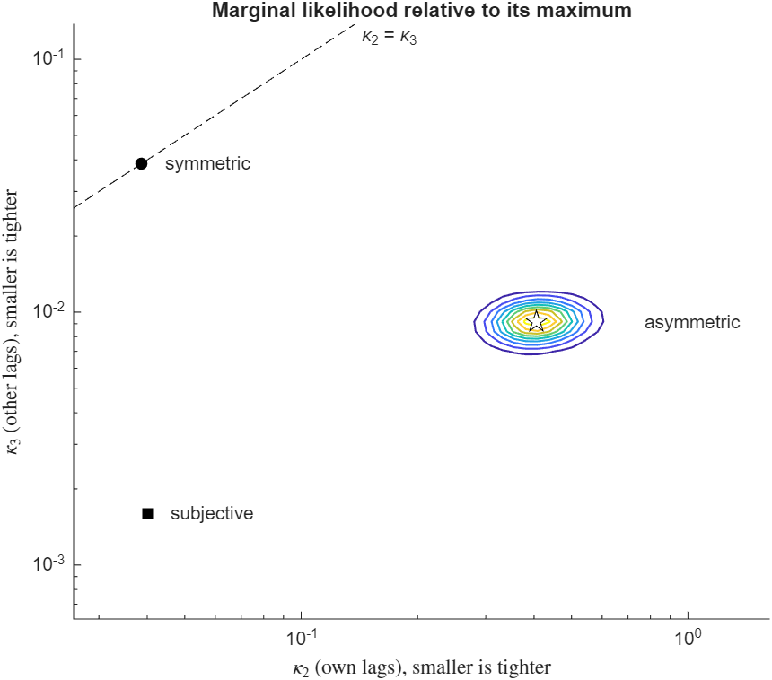
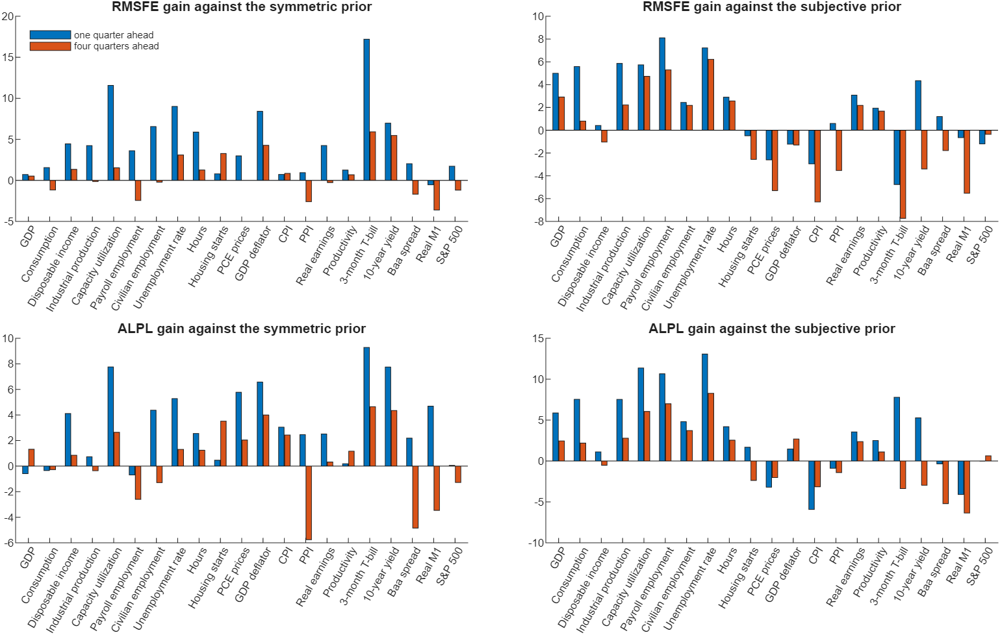

# How Should I Choose the Shrinkage Hyperparameters of My BVAR?

*Code: [`build.m`](build.m) and [`your_data.m`](your_data.m), which call
[`bvar.priors.acp_opt_kappa`](../../core/+bvar/+priors/acp_opt_kappa.m) and
[`bvar.ml.acp`](../../core/+bvar/+ml/acp.m). Method: [Chan (2022)](../../CITING.md#chan-2022).*

In this tutorial we choose the shrinkage hyperparameters of a large Bayesian VAR by maximizing
its marginal likelihood. The natural conjugate prior makes this easy, because its marginal
likelihood is available in closed form, but it forces the same shrinkage on the coefficients of
a variable's own lags and of other variables' lags. The asymmetric conjugate prior of Chan (2022)
allows the two to differ and keeps the closed form. In a VAR of 21 US macroeconomic and financial
variables from 1959 to 2018, the application of the working-paper version of Chan (2022), the
marginal likelihood selects an own-lag hyperparameter of 0.41 and an other-lag hyperparameter of
0.0092, so the coefficients on other variables' lags are shrunk much more strongly (Figure 1).
Imposing the same shrinkage on both lowers the maximized log marginal likelihood by 235. In
recursive forecasts from 1985 to 2018, the asymmetric prior improves the one-quarter-ahead point
forecasts of 20 of the 21 variables relative to the best symmetric prior, and it gives the best
joint density forecasts of all 21 variables among the three priors we compare.

## Try It Now

Two commands, from the root of the repository:

| Command | What it produces | Time |
|---|---|---|
| `run tutorials/shrinkage/your_data.m` | the three priors, the lag-length scan and the contour plot | about 10 seconds |
| `run tutorials/shrinkage/build.m` | every number and figure on this page, including the forecast comparison | about 13 minutes |

With the settings as they ship, `your_data.m` reports an own-lag hyperparameter of 0.406 and an
other-lag hyperparameter of 0.0092, which is the quickest check that the installation works.
Its settings block is where you point it at your own file. This workflow needs MATLAB with the
Statistics and Machine Learning Toolbox; the other toolboxes `setup.m` reports on belong to other
parts of the repository.



*Figure 1: Marginal likelihood of the 21-variable VAR under the asymmetric conjugate prior, as a
function of the own-lag hyperparameter $`\kappa_2`$ and the other-lag hyperparameter $`\kappa_3`$,
on logarithmic axes, normalized so that its maximum equals one. Smaller values shrink harder.
Under a flat prior on $`(\kappa_2, \kappa_3)`$ the surface is proportional to their joint posterior
density. The contours are at 0.1, 0.2, ..., 0.9; the star marks the maximum, the circle the best
symmetric prior and the square the subjective prior, and the dashed line is the restriction
$`\kappa_2 = \kappa_3`$.*

## The Shrinkage Problem

In the 21-variable VAR of this tutorial, with four lags, each equation has four coefficients on
its own lags and eighty on the lags of other variables. A single shrinkage hyperparameter has to
serve both groups at once. Two hyperparameters allow the four own-lag coefficients to be shrunk
gently while the eighty cross-variable coefficients are shrunk hard.

Consider a VAR with $`n`$ variables and $`p`$ lags. Minnesota-type priors shrink its coefficients
toward a random walk for nonstationary variables and toward zero otherwise, and more strongly at
longer lags. The prior variance of the coefficient on the $`\ell`$th lag of variable $`r`$ in
equation $`i`$ is $`\sigma_i^2`$ times

$$\frac{\kappa_2}{\ell^2 s_i^2} \quad \text{if } r = i \text{ (own lag)}, \qquad \frac{\kappa_3}{\ell^2 s_r^2} \quad \text{if } r \neq i \text{ (other lag)},$$

where $`\sigma_i^2`$ is the error variance of equation $`i`$ and $`s_r^2`$ is the residual variance of
a univariate autoregression for variable $`r`$. The entry for the intercepts is $`\kappa_1 = 100`$,
so they are hardly shrunk. The hyperparameters $`\kappa_2`$ and $`\kappa_3`$ control the overall
shrinkage of the coefficients on own lags and on other variables' lags. Recent work emphasizes
that they should be estimated from the data rather than fixed in advance, because their values
can have an important effect on forecasts and inference (Carriero, Clark and Marcellino, 2015;
Giannone, Lenza and Primiceri, 2015).

The natural conjugate prior assumes that the prior covariance matrix of the VAR coefficients has
the Kronecker structure $`\boldsymbol{\Sigma}\otimes\mathbf{V}`$. This structure gives a
closed-form marginal likelihood, so the shrinkage can be chosen by maximizing it, but it treats
own and other lags symmetrically and therefore requires $`\kappa_2 = \kappa_3`$. The independent
normal and inverse-Wishart prior allows $`\kappa_2 \neq \kappa_3`$, but its marginal likelihood is
not available in closed form and has to be estimated by simulation, which makes a search over
the hyperparameters costly.

The asymmetric conjugate prior of Chan (2022) has both properties. It writes the VAR in a
recursive structural form, in which each equation is a linear regression on the lags and on the
contemporaneous values of the variables ordered before it, and gives each equation its own
normal-inverse-gamma prior with the variances above. Own and other lags can then be shrunk by
different amounts, the marginal likelihood is a sum of closed-form terms over the equations, and
independent posterior draws can be obtained directly, without Markov chain Monte Carlo. The
implied prior on the reduced-form error covariance matrix is the same inverse-Wishart prior as
under the natural conjugate prior.

Because the marginal likelihood is available in closed form, $`\kappa_2`$ and $`\kappa_3`$ can be
chosen by maximizing it, an empirical Bayes approach, in a matter of seconds. Everything below
conditions on the maximized values: the posterior draws and the forecasts treat them as known,
and their uncertainty is left out. Alternatively, under a flat prior on $`(\kappa_2, \kappa_3)`$,
the marginal likelihood as a function of the two hyperparameters is proportional to their joint
posterior density. Chan (2022) writes the two
hyperparameters as $`\kappa_1`$ and $`\kappa_2`$, and `bvar.priors.acp_opt_kappa` returns them as
`kappa(1)` and `kappa(2)`.

## Results for a 21-Variable VAR

We use the dataset of the working-paper version of Chan (2022), Chan (2019): 21 quarterly US
series from the FRED-QD database (McCracken and Ng, 2021), listed below. Most are annualized
growth rates; the unemployment rate, capacity utilization, the two interest rates and the credit
spread are in levels. Because all series are stationary, every prior mean is zero. After the
transformations the data run from 1959:Q3 to 2018:Q4. The VAR has four lags, and the first eight
quarters serve as initial conditions, so the estimation sample runs from 1961:Q3 to 2018:Q4.

<details> <summary>The 21 variables</summary>

| | Variable | Transformation |
|---|---|---|
| 1 | Real gross domestic product | 400 Δ log |
| 2 | Personal consumption expenditures | 400 Δ log |
| 3 | Real disposable personal income | 400 Δ log |
| 4 | Industrial production index | 400 Δ log |
| 5 | Capacity utilization: manufacturing | none |
| 6 | All employees: total nonfarm | 400 Δ log |
| 7 | Civilian employment | 400 Δ log |
| 8 | Civilian unemployment rate | none |
| 9 | Nonfarm business sector: hours of all persons | 400 Δ log |
| 10 | Housing starts | 400 Δ log |
| 11 | PCE chain-type price index | 400 Δ log |
| 12 | GDP chain-type price index | 400 Δ log |
| 13 | Consumer price index | 400 Δ log |
| 14 | Producer price index for all commodities | 400 Δ log |
| 15 | Real average hourly earnings, manufacturing | 400 Δ log |
| 16 | Nonfarm business sector: real output per hour | 400 Δ log |
| 17 | 3-month Treasury bill rate | none |
| 18 | 10-year Treasury constant maturity rate | none |
| 19 | Moody's Baa corporate bond yield minus the 10-year Treasury rate | none |
| 20 | Real M1 money stock | 400 Δ log |
| 21 | S&P 500 composite stock price index | 400 Δ log |

</details>

Table 1 reports the log marginal likelihood under three priors. The symmetric prior sets
$`\kappa_2 = \kappa_3`$ and chooses the common value by maximizing the marginal likelihood, which
mimics the natural conjugate prior. The subjective prior sets $`\kappa_2 = 0.04`$ and
$`\kappa_3 = 0.0016`$, following Carriero, Clark and Marcellino (2015). The asymmetric prior
chooses $`\kappa_2`$ and $`\kappa_3`$ jointly. Table 1 reproduces Table 2 of Chan (2019).

*Table 1: Hyperparameters and log marginal likelihood of the 21-variable VAR under three priors.
The symmetric and asymmetric rows report the maximum over their hyperparameters, and the
subjective row the value at the fixed pair. The last column is the difference from the asymmetric
prior.*

| Prior | $`\kappa_2`$ (own lags) | $`\kappa_3`$ (other lags) | Log marginal likelihood | Difference |
|---|---|---|---|---|
| Symmetric | 0.039 | 0.039 | -9436.3 | -235.2 |
| Subjective | 0.04 | 0.0016 | -9371.9 | -170.8 |
| Asymmetric | 0.406 | 0.0092 | -9201.1 | |

When the two hyperparameters may differ, the optimal $`\kappa_2`$ is ten times the symmetric
optimum and the optimal $`\kappa_3`$ is about a quarter of it, so the data favor shrinking the
coefficients on other variables' lags much more strongly than those on own lags. The asymmetric
prior raises the maximized log marginal likelihood by 235.2 over the symmetric prior and by 170.8
over the subjective prior. Figure 1 shows the marginal likelihood on a logarithmic grid that
spans all three priors. The intervals that follow are grid approximations on the grid of
Chan (2019), $`\kappa_2`$ from 0.25 to 0.65 and $`\kappa_3`$ from 0.002 to 0.02: under a flat prior,
90% of the mass of $`\kappa_2`$ lies between 0.32 and 0.56 and that of $`\kappa_3`$ between 0.0074
and 0.0114, with 0.3% of the $`\kappa_2`$ mass and 6e-11 of the $`\kappa_3`$ mass at the edges of
that support. Both benchmark priors lie outside it, and Figure 1 places them well below the
contours. The published version of Chan (2022) applies the prior to
a 15-variable VAR over 1985–2019, where relaxing the restriction $`\kappa_2 = \kappa_3`$ raises the
log marginal likelihood by 8.3.

## What the Choice Changes

The choice changes the posterior means of the VAR coefficients substantially. Measured in the
units in which the prior is set, that is, multiplied by $`s_r/s_i`$, the coefficients on other
variables' lags are on average 34% smaller in absolute value under the asymmetric prior than
under the symmetric prior, and the coefficients on own lags are 31% larger. The subjective prior
shrinks the coefficients on other variables' lags even more strongly, to about a third of their
size under the symmetric prior.

The closed-form marginal likelihood also selects the lag length. Table 2 chooses $`\kappa_2`$ and
$`\kappa_3`$ again for each lag length from one to eight, holding the estimation sample fixed.
Under the asymmetric prior the marginal likelihood increases with the lag length up to eight
lags, the longest the initial conditions allow; under the symmetric prior it changes little
beyond three lags. The asymmetric prior is preferred to the symmetric prior at every lag length,
by 220 to 249.

*Table 2: Optimal hyperparameters and log marginal likelihood of the 21-variable VAR by lag
length. The estimation sample is 1961:Q3–2018:Q4 for every lag length.*

| Lags | $`\kappa_2`$ | $`\kappa_3`$ | Log marginal likelihood, asymmetric | $`\kappa_2 = \kappa_3`$, symmetric | Log marginal likelihood, symmetric |
|---|---|---|---|---|---|
| 1 | 0.896 | 0.0075 | -9253.4 | 0.056 | -9478.9 |
| 2 | 0.592 | 0.0094 | -9226.8 | 0.044 | -9446.7 |
| 3 | 0.463 | 0.0089 | -9203.3 | 0.040 | -9437.8 |
| 4 | 0.406 | 0.0092 | -9201.1 | 0.039 | -9436.3 |
| 5 | 0.363 | 0.0089 | -9201.0 | 0.037 | -9440.2 |
| 6 | 0.357 | 0.0087 | -9195.2 | 0.037 | -9440.3 |
| 7 | 0.339 | 0.0086 | -9191.9 | 0.037 | -9440.0 |
| 8 | 0.341 | 0.0087 | -9185.3 | 0.038 | -9434.2 |

Finally, we repeat the recursive forecasting exercise of Chan (2019). It is pseudo-out-of-sample:
it truncates the single 2018:Q4 vintage at each origin, so the early samples hold the values as
revised by the end of the sample. For each quarter from 1984:Q4 to 2018:Q3, we estimate the VAR
on the data up to that quarter, choose the hyperparameters of the symmetric and asymmetric priors
by maximizing the marginal likelihood, and obtain 10,000 independent posterior draws under each
prior. We then forecast all 21
variables one and four quarters ahead, for targets from 1985:Q1 to 2018:Q4. Across the 136
estimation samples, the optimal $`\kappa_2`$ stays between 0.405 and 0.487 and the optimal
$`\kappa_3`$ between 0.0086 and 0.0135. We evaluate the point forecasts by the root mean squared
forecast error (RMSFE) and the density forecasts by the average log predictive likelihood
(ALPL). Following Carriero, Clark and Marcellino (2015) and Chan (2019), we report the gain of
the asymmetric prior over a benchmark as $`100\times(1 - \text{RMSFE}/\text{RMSFE}_B)`$ for point
forecasts and as $`100\times(\text{ALPL} - \text{ALPL}_B)`$ for density forecasts. The first is a
percentage; the second is a difference of average log scores multiplied by 100.

*Table 3: Gains of the asymmetric prior over the two benchmark priors across the 21 variables,
1985:Q1–2018:Q4. RMSFE gains are percentages and the ALPL column is 100 times a difference of
average log predictive likelihoods. The significant gains and losses are those in a two-sided
Diebold-Mariano test at the 5% level.*

| Benchmark | Horizon | Median RMSFE gain | Variables with an RMSFE gain | Significant RMSFE gains / losses | Median 100 × ALPL difference | Variables with a higher ALPL | Significant ALPL gains / losses |
|---|---|---|---|---|---|---|---|
| Symmetric | 1 | 3.61 | 20 | 8 / 0 | 2.55 | 18 | 5 / 0 |
| Symmetric | 4 | 0.52 | 11 | 2 / 0 | 1.17 | 13 | 4 / 0 |
| Subjective | 1 | 1.93 | 14 | 0 / 0 | 3.55 | 15 | 11 / 0 |
| Subjective | 4 | -0.36 | 10 | 0 / 2 | 1.11 | 12 | 1 / 0 |

Table 3 summarizes the results, and Figure 2 shows them variable by variable. Against the
symmetric prior, the asymmetric prior improves the one-quarter-ahead point forecasts of 20 of
the 21 variables, with a median RMSFE gain of 3.6%; eight of the gains are significant at the 5%
level and none of the losses is. The largest gains are for the 3-month Treasury bill rate (17%)
and capacity utilization (12%). Four quarters ahead the gains are smaller, with a median of 0.5%.
Against the subjective prior, the asymmetric prior gives better one-quarter-ahead density
forecasts for 15 variables, 11 of them significantly, and a median ALPL difference of 3.55 in
those units. Four
quarters ahead its point forecasts are slightly less accurate than those of the subjective prior,
with a median RMSFE gain of -0.4% and significant losses for two variables. These results are close to those of Chan (2019), who reports median
RMSFE gains against the symmetric prior of 3.41% one quarter ahead and 0.72% four quarters ahead,
and against the subjective prior of 2% and -0.23%.



*Figure 2: Gains of the asymmetric prior in RMSFE (top) and ALPL (bottom) against the symmetric
prior (left) and the subjective prior (right), one quarter ahead (blue) and four quarters ahead
(red), 1985:Q1–2018:Q4. Positive values favor the asymmetric prior.*

<details> <summary>Table 4: Gains of the asymmetric prior by variable</summary>

RMSFE gains are percentages and the ALPL columns are 100 times a difference of average log
predictive likelihoods. The symbols \*, \*\* and \*\*\* denote significance at the 10%, 5% and 1%
levels in a two-sided Diebold-Mariano test against the benchmark.

| Variable | RMSFE, h = 1, symmetric | RMSFE, h = 4, symmetric | ALPL, h = 1, symmetric | ALPL, h = 4, symmetric | RMSFE, h = 1, subjective | RMSFE, h = 4, subjective | ALPL, h = 1, subjective | ALPL, h = 4, subjective |
|---|---|---|---|---|---|---|---|---|
| GDP | 0.7 | 0.5 | -0.6 | 1.3 | 5.0 | 2.9 | 5.9*** | 2.4* |
| Consumption | 1.6 | -1.2 | -0.3 | -0.3 | 5.6* | 0.8 | 7.5*** | 2.2 |
| Disposable income | 4.4** | 1.3* | 4.1* | 0.9 | 0.4 | -1.0 | 1.1 | -0.5 |
| Industrial production | 4.2 | -0.1 | 0.7 | -0.4 | 5.9 | 2.2 | 7.5*** | 2.8 |
| Capacity utilization | 11.6*** | 1.5 | 7.8*** | 2.6 | 5.7 | 4.7 | 11.4*** | 6.1 |
| Payroll employment | 3.6 | -2.4 | -0.7 | -2.6 | 8.1* | 5.3* | 10.7*** | 7.0* |
| Civilian employment | 6.6** | -0.2 | 4.4* | -1.3 | 2.4 | 2.2 | 4.8** | 3.7 |
| Unemployment rate | 9.0** | 3.1 | 5.3*** | 1.3 | 7.2 | 6.2 | 13.1*** | 8.3 |
| Hours | 5.9** | 1.3 | 2.6 | 1.2 | 2.9 | 2.6 | 4.2** | 2.5 |
| Housing starts | 0.8 | 3.3** | 0.5 | 3.5*** | -0.5 | -2.6 | 1.7 | -2.4 |
| PCE prices | 3.0 | -0.0 | 5.8* | 2.0 | -2.6* | -5.3* | -3.2 | -2.0 |
| GDP deflator | 8.4*** | 4.3 | 6.6*** | 4.0** | -1.2 | -1.3 | 1.5 | 2.7 |
| CPI | 0.7 | 0.9 | 3.0 | 2.4 | -3.0 | -6.3** | -5.9 | -3.1* |
| PPI | 0.9 | -2.6 | 2.5 | -5.8 | 0.6 | -3.5* | -0.9 | -1.4 |
| Real earnings | 4.2 | -0.3 | 2.5 | 0.3 | 3.1* | 2.2 | 3.5*** | 2.4** |
| Productivity | 1.3 | 0.7 | 0.2 | 1.2** | 1.9 | 1.7 | 2.5 | 1.1 |
| 3-month T-bill | 17.2*** | 5.9** | 9.3*** | 4.6** | -4.8 | -7.7* | 7.8*** | -3.4 |
| 10-year yield | 7.0*** | 5.5* | 7.8*** | 4.4 | 4.3* | -3.4 | 5.3*** | -3.0 |
| Baa spread | 2.0 | -1.7 | 2.2 | -4.8 | 1.2 | -1.8 | -0.4 | -5.2 |
| Real M1 | -0.5 | -3.6 | 4.7 | -3.5 | -0.7 | -5.5** | -4.1 | -6.4 |
| S&P 500 | 1.7 | -1.2 | 0.1 | -1.3 | -1.2 | -0.4 | -0.0 | 0.6 |

</details>

The closed-form marginal likelihood also gives the joint one-step-ahead predictive likelihood of
all 21 variables exactly, as
$`\log p(\mathbf{y}_{t+1}\mid\mathbf{y}_{1:t}) = \log p(\mathbf{y}_{1:t+1}) - \log p(\mathbf{y}_{1:t})`$
with the prior held fixed. Summed over the 136 quarters, it is -5112.4 under the symmetric prior,
-5062.9 under the subjective prior and -4974.1 under the asymmetric prior. The Diebold-Mariano
statistics of the asymmetric prior against the two benchmarks are 7.1 and 6.3.

## Applying the Method to Your Data

The script [`your_data.m`](your_data.m) applies the same analysis to any dataset. Set the file,
the columns, their names, the date column, which variables are nonstationary, the lag lengths and
the number of initial conditions in its settings block. Columns may be given by number, counting
every column of the file, or by name. The script drops rows missing at either end of the sample,
and stops on a missing value inside it, on unevenly spaced dates when a date column is given, and
on a constant series. It then chooses $`\kappa_2`$ and $`\kappa_3`$ under the three priors, repeats
the choice for each lag length, and plots the marginal likelihood around the optimum on a
logarithmic grid. With its default settings, which use the dataset of this tutorial, it
reproduces Tables 1 and 2 in about 10 seconds.

The `nonstationary` setting lists the variables whose first own lag has prior mean one. It
centers the prior and leaves the data alone: a stationary interest rate can enter untransformed
without belonging on that list, and every series must be transformed to stationarity before the
script sees it. The choice itself takes two calls:

```matlab
[~, Z] = bvar.util.build_lags([Y0(end-p+1:end,:); Y], p);
[lml, kappa] = bvar.priors.acp_opt_kappa(Y0, Y, Z, p, [.04 .04], 'stru', nonstationary);
[lml_sym, kappa_sym] = bvar.priors.acp_opt_kappa(Y0, Y, Z, p, [], 'stru', nonstationary, 'symmetric', true);
```

Here `Y0` holds the initial conditions and `kappa(1)` and `kappa(2)` are $`\kappa_2`$ and
$`\kappa_3`$. The symmetric search runs `fminbnd` on $`(0,1)`$ and the asymmetric one `fminsearch`
over the logarithms of the two hyperparameters, which covers all positive values; `your_data.m`
repeats the asymmetric search from the symmetric optimum and reports how far apart the two
maxima are. Independent posterior draws at the chosen values take three more:

```matlab
prior = bvar.priors.acp_stru(n, p, kappa, bvar.priors.resid_var_ar4(Y0, Y), nonstationary);
[Alp, Beta, Sig] = bvar.samplers.acp_theta_sig(Y0, Y, p, prior, nsim);
[A, Sigma] = bvar.structural.reduced_form(Alp, Beta, Sig);
```

Each row of `A` is one draw of the reduced-form coefficients, stacked equation by equation with
the intercept first, and `Sigma(d,:,:)` is the error covariance matrix of draw `d`. The published
application of Chan (2022) sets the prior on the reduced-form coefficients instead; replacing
`'stru'` with `'redu'` and `acp_stru` with `acp_redu` selects that version.

## Implementations in R and Python

The book repository
[bayesian-macroeconometrics](https://github.com/joshuaccchan/bayesian-macroeconometrics)
implements the asymmetric conjugate prior in MATLAB, R and Python. The function
`chapter12/ml_VAR_ACP` computes its marginal likelihood, and the script
`chapter12/VAR_ACP_kappa` evaluates it over a grid of $`(\kappa_2, \kappa_3)`$ for a four-variable
VAR with seven lags. In that application the marginal likelihood is maximized at
$`\kappa_2 \approx 0.35`$ and $`\kappa_3 \approx 0.015`$, and imposing $`\kappa_2 = \kappa_3`$ lowers the
log marginal likelihood by about 19 (Chan, forthcoming, Section 12.3.3).
[`RELATED.md`](../../RELATED.md) lists the R and Python counterparts of the other models in this
repository.

## Reproducing the Results

To reproduce all results on this page, run the build script from the root of the repository:

```matlab
run tutorials/shrinkage/build.m
```

The script `build.m` reads the data of the replication package of Chan (2019) in
`replications/chan2019wp_acp`, checks the three priors against the capture in `tests/golden` and
against Table 2 of the paper, and evaluates the marginal likelihood over the grid of its
Figure 1, which gives the intervals quoted above, and over the wider logarithmic grid of Figure 1
here. It then draws from the posterior, scans the lag length and runs the forecasting exercise,
whose code is not part of the package. The computation took 12.7 minutes using MATLAB
R2025b on a computer with an Intel Core Ultra 7 255U processor and 32 GB of RAM. All results in
this tutorial are printed in [`build_log.txt`](build_log.txt) or computed from numbers printed
there, and the figures are saved in the same folder.

## References

Carriero, A., Clark, T. E. and Marcellino, M. (2015). Bayesian VARs: Specification Choices and
Forecast Accuracy. *Journal of Applied Econometrics*, 30(1): 46-73.
[doi:10.1002/jae.2315](https://doi.org/10.1002/jae.2315)

Chan, J. C. C. (2019). Asymmetric Conjugate Priors for Large Bayesian VARs. CAMA Working Paper
51/2019, Australian National University. [PDF](https://joshuachan.org/papers/BVAR-ACP.pdf)

Chan, J. C. C. (2022). Asymmetric Conjugate Priors for Large Bayesian VARs. *Quantitative
Economics*, 13(3): 1145-1169. [doi:10.3982/QE1381](https://doi.org/10.3982/QE1381)

Chan, J. C. C. (forthcoming). *Bayesian Macroeconometrics: Methods and Applications*. Chapman &
Hall/CRC. [Code repository](https://github.com/joshuaccchan/bayesian-macroeconometrics)

Giannone, D., Lenza, M. and Primiceri, G. E. (2015). Prior Selection for Vector Autoregressions.
*Review of Economics and Statistics*, 97(2): 436-451.
[doi:10.1162/REST_a_00483](https://doi.org/10.1162/REST_a_00483)

McCracken, M. W. and Ng, S. (2021). FRED-QD: A Quarterly Database for Macroeconomic Research.
*Federal Reserve Bank of St. Louis Review*, 103(1): 1-44.
[doi:10.20955/r.103.1-44](https://doi.org/10.20955/r.103.1-44)

The BibTeX entry for Chan (2022) is in [`CITING.md`](../../CITING.md); those for the other
papers are:

```bibtex
@article{CCM15,
  author  = {Carriero, A. and Clark, T. E. and Marcellino, M.},
  title   = {Bayesian {VARs}: Specification Choices and Forecast Accuracy},
  journal = {Journal of Applied Econometrics},
  year    = {2015},
  volume  = {30},
  number  = {1},
  pages   = {46--73},
  doi     = {10.1002/jae.2315}
}

@techreport{chan19acp,
  author      = {Chan, J. C. C.},
  title       = {Asymmetric Conjugate Priors for Large {Bayesian} {VARs}},
  institution = {Australian National University},
  type        = {CAMA Working Paper},
  number      = {51/2019},
  year        = {2019}
}

@article{GLP15,
  author  = {Giannone, D. and Lenza, M. and Primiceri, G. E.},
  title   = {Prior Selection for Vector Autoregressions},
  journal = {Review of Economics and Statistics},
  year    = {2015},
  volume  = {97},
  number  = {2},
  pages   = {436--451},
  doi     = {10.1162/REST_a_00483}
}

@article{MN21,
  author  = {McCracken, M. W. and Ng, S.},
  title   = {{FRED-QD}: A Quarterly Database for Macroeconomic Research},
  journal = {Federal Reserve Bank of St. Louis Review},
  year    = {2021},
  volume  = {103},
  number  = {1},
  pages   = {1--44},
  doi     = {10.20955/r.103.1-44}
}
```
