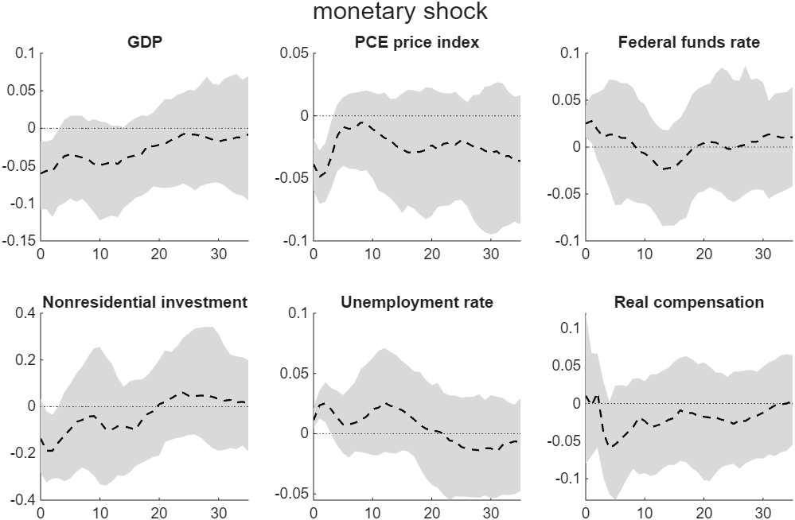
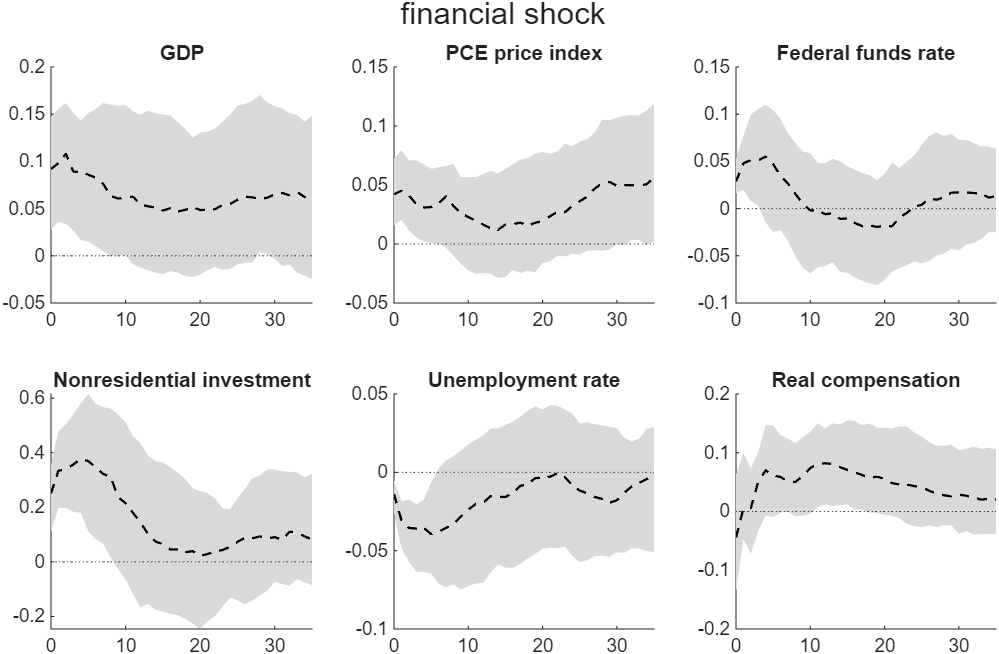

# Can I Use Many Sign Restrictions in My Large VAR?

*Code: [`build.m`](build.m) and [`your_data.m`](your_data.m), which call
[`bvar.structural.sign_assign`](../../core/+bvar/+structural/sign_assign.m),
[`bvar.structural.sign_restrict`](../../core/+bvar/+structural/sign_restrict.m),
[`bvar.structural.qr_sign`](../../core/+bvar/+structural/qr_sign.m),
[`bvar.structural.check_separable`](../../core/+bvar/+structural/check_separable.m),
[`bvar.structural.irf_redu`](../../core/+bvar/+structural/irf_redu.m) and the asymmetric
conjugate prior of [`bvar.priors`](../../core/+bvar/+priors/). Method:
[Chan, Matthes and Yu (2026)](../../CITING.md#chan-matthes-and-yu-2026),
[Chan (2022)](../../CITING.md#chan-2022) and
[Rubio-Ramírez, Waggoner and Zha (2010)](../../CITING.md#rubio-ramírez-waggoner-and-zha-2010).*

In this tutorial we identify eight structural shocks in a 35-variable US VAR using 98 sign
restrictions and 7 ranking restrictions on the impact responses. The conventional accept-reject
algorithm of Rubio-Ramírez, Waggoner and Zha (2010) is not computationally feasible at this scale,
and it accepts none of the 776,000 candidate draws made here. The algorithm of Chan, Matthes and
Yu (2026) obtains 100 draws that satisfy every restriction from those same candidates, one in
7,760, and targets the same posterior distribution. The two algorithms differ only in which column
of a candidate rotation may represent which shock.

## Try It Now

Two commands, from the root of the repository:

| Command | What it produces | Time |
|---|---|---|
| `run tutorials/sign_restrictions/your_data.m` | three shocks in a five-variable VAR, on your own data and restrictions | a few seconds |
| `run tutorials/sign_restrictions/build.m` | every number and figure on this page | ten minutes |

This workflow needs MATLAB with the Statistics and Machine Learning Toolbox.



*Figure 1: Responses of six of the 35 variables to a one-standard-deviation monetary policy shock,
over 36 quarters. The dashed line denotes the posterior median and the shaded area the 68 percent
credible band, over the 100 admissible draws. Output, prices and investment fall, unemployment
rises and the funds rate rises on impact; only the impact signs are restricted, so the paths
beyond quarter zero are what the data and the prior imply.*

## Identification and the Labeling of the Columns

A reduced-form VAR identifies the covariance matrix $`\mathbf{\Sigma}`$. Every
$`\mathbf{L}_0\mathbf{Q}`$ with $`\mathbf{L}_0\mathbf{L}_0' = \mathbf{\Sigma}`$ and $`\mathbf{Q}`$
orthogonal is an admissible impact matrix, so identification means keeping the rotations whose
impact responses have the signs the economic theory requires, and the set of accepted rotations is
the object of inference.

The rejection algorithm of Rubio-Ramírez, Waggoner and Zha (2010) draws $`\mathbf{Q}`$ uniformly
and asks whether column $`i`$ satisfies the restrictions of shock $`i`$, for every restricted
shock. That test fixes a labeling of the columns, and the labeling is arbitrary: a rotation whose
third column satisfies the monetary restrictions gives the same structural model as one whose
first column does. With $`m`$ restricted shocks among $`n`$ variables there are $`n!/(n-m)!`$ ways
to assign shocks to columns, which is $`9.5 \times 10^{11}`$ here. Both rules may flip the sign of
a column, so what separates them is the assignment, and the rejection algorithm tests one of the
$`9.5 \times 10^{11}`$.

[`bvar.structural.sign_assign`](../../core/+bvar/+structural/sign_assign.m) builds the
$`m \times n`$ table of which columns admit which shocks, accepts the candidate whenever every
shock has at least one, and then draws an assignment uniformly from those available. Proposition 1
of Chan, Matthes and Yu (2026) shows that the accepted impact matrix is still
$`\mathbf{L}_0\mathbf{Q}^*`$ for a $`\mathbf{Q}^*`$ uniform on the orthogonal group, so the target
distribution is unchanged.

The rule needs the restrictions to separate the shocks, which is Assumption 2 of that paper. For
every pair of shocks, one of two things must hold: either some variable is restricted with the
same sign under both and another with opposite signs, or a ranking restriction on the same two
variables points one way for one shock and the other way for the other. Either one makes the sets
of columns admissible for the two shocks disjoint, so each shock's column can be drawn
independently of the others and no column is assigned twice. Of the 28 pairs in this application,
23 are separated by their signs and 5 only by the ranking restrictions.

When the condition fails there may be no valid assignment at all, and the paper's second
algorithm, which enumerates the admissible set instead, is what covers that case; the library
implements the first only. `sign_assign` runs once per candidate rotation, so it does not test the
condition itself;
[`bvar.structural.check_separable`](../../core/+bvar/+structural/check_separable.m) tests it once,
and both scripts here call it before the rejection loop. Called with the sign restrictions alone
it reports the pairs that only the ranking restrictions separate, which is where the 23 and the 5
come from.

## The Model and the Data

The data are the 35 quarterly US series of the paper's replication package, in
[`replications/chan_matthes_yu2026_qe_svarsign`](../../replications/chan_matthes_yu2026_qe_svarsign),
from 1983Q1 to 2019Q4, 148 quarters. They cover national accounts, five price indices, labor
market and productivity series, industrial production, interest rates across the curve, credit
spreads, the dollar, the S&P 500 and the oil price. Twenty of the 35 enter as 100 times a log
level; the rest, among them the eight interest rates, the unemployment rate and capacity
utilization, enter untransformed. The VAR has five lags and uses the first eight quarters as
initial conditions, leaving 140 observations.

The prior is the asymmetric conjugate prior of Chan (2022), which shrinks own lags and cross lags
differently and keeps the posterior available in closed form, so the posterior draws are
independent. Its two shrinkage hyperparameters are chosen by maximizing the marginal likelihood,
which gives 0.244 on own lags and 0.0025 on cross lags: at 35 variables the cross-lag coefficients
are shrunk about a hundred times harder than the own lags. The marginal likelihood is evaluated
with the ridge of $`10^{-6}`$ that this package adds to the posterior precision, which is what
reproduces its hyperparameters.

## The Restrictions

Every restriction is on the impact response, quarter zero. The signs below are those of Table 1 of
the paper, and [`build.m`](build.m) checks the matrices it writes out against the ones in the
package's own driver.

| Shock | Impact response restricted to rise | to fall |
|---|---|---|
| Demand | output, the five price indices, industrial production, capacity utilization, the funds rate, the 3-month bill, the prime rate | unemployment |
| Investment | the same eleven | unemployment, the S&P 500 |
| Financial | the same eleven and the S&P 500 | unemployment |
| Monetary | unemployment and seven rates from the funds rate to the Baa yield | output, the five price indices, employment, industrial production, capacity utilization, the S&P 500 |
| Government spending | output, government spending, federal tax receipts, the five price indices, the funds rate, the 3-month bill, the prime rate | the federal surplus, unemployment |
| Technology | output, consumption, nonresidential investment, the hourly wage, labor productivity, utilization-adjusted TFP | the five price indices, unemployment |
| Labor supply | output, unemployment | the five price indices, the hourly wage |
| Wage bargaining | output | the five price indices, the hourly wage, unemployment |

Sign restrictions alone do not separate five pairs of shocks: demand from investment, financial
and government spending, and government spending from investment and financial. In each pair both
shocks raise output and prices, and no variable is restricted in opposite directions. Seven
ranking restrictions separate them by how large one response is relative to another:

- under a demand shock, investment rises by no more than output, and government spending by no
  more than output;
- under an investment shock and under a financial shock, investment rises by more than output,
  while government spending rises by no more;
- under a government spending shock, government spending rises by more than output.

A ranking restriction is a linear combination of impact responses required to be nonpositive, so
it costs the same to test as a sign restriction. The restrictions bind in the admissible draws:
the median impact gap between investment and output is 0.160 under the financial shock and −0.084
under the demand shock, and government spending exceeds output by 0.043 under the government
spending shock.

## Acceptance Rates of the Two Algorithms

The build draws candidate rotations in batches of 1,000, one rotation per posterior draw, and
applies both rules to each.

| | admissible draws | candidates | candidates per draw |
|---|---|---|---|
| `sign_assign` | 100 | 776,000 | 7,760 |
| `sign_restrict` | 0 | 776,000 | — |

The paper reports about 5,500 candidates per draw for this application, against the 7,760 here, on
a different draw of rotations and at ten times the length.

## The Impulse Responses

*Table 1: Impact response to a one-standard-deviation shock, posterior median over the 100
admissible draws, for six of the 35 variables.*

| Shock | GDP | Prices | Fed funds | Investment | Unemployment | Compensation |
|---|---|---|---|---|---|---|
| Demand | 0.070 | 0.042 | 0.028 | −0.014 | −0.017 | −0.056 |
| Investment | 0.046 | 0.041 | 0.029 | 0.188 | −0.017 | −0.057 |
| Financial | 0.092 | 0.042 | 0.029 | 0.252 | −0.014 | −0.044 |
| Monetary | −0.060 | −0.039 | 0.025 | −0.136 | 0.011 | 0.010 |
| Government spending | 0.043 | 0.034 | 0.021 | 0.062 | −0.014 | −0.018 |
| Technology | 0.076 | −0.046 | 0.013 | 0.158 | −0.016 | 0.101 |
| Labor supply | 0.041 | −0.024 | 0.003 | 0.031 | 0.011 | −0.047 |
| Wage bargaining | 0.051 | −0.029 | 0.013 | 0.081 | −0.013 | −0.039 |

The restricted entries have the signs they are given, which checks the code. The unrestricted
entries are the results. Real compensation is restricted only under the technology, labor supply
and wage bargaining shocks, and it is where the three supply shocks separate: technology raises it
by 0.101 while lowering prices, labor supply lowers it by 0.047 while raising unemployment, and
wage bargaining lowers it by 0.039 while lowering unemployment. The funds rate response is
restricted to rise under five of the eight shocks and is unrestricted under the three supply
shocks, where it comes out positive but small.



*Figure 2: Responses to a one-standard-deviation financial shock, drawn as in Figure 1. The impact
restriction on investment relative to output is what separates this shock from a demand shock:
investment rises by 0.252 against output's 0.092.*

Both figures are drawn from 100 admissible draws, which is enough for the median path and leaves
the bands visibly ragged. The paper uses 1,000, at ten times the runtime.

## Applying the Method to Your Data

[`your_data.m`](your_data.m) runs the same exercise on any csv. Restrictions are given per shock
as two index lists into the selected columns, and a ranking restriction is a row
`[shock, a, b]` meaning that for that shock the impact response of variable `a` is at most the
impact response of variable `b`:

```matlab
shock = ["demand" "supply" "monetary"];
pos = {[1 2 3], 1, [3 4]};          % impact responses restricted to rise
neg = {4, [2 3 4], [1 2]};          % and to fall
ranking = [3 1 2];                  % under shock 3, variable 1 rises by no more than variable 2
```

The script checks the separability condition, chooses the shrinkage by marginal likelihood, draws
until `nkeep` rotations are admissible, prints the impact responses, plots each shock and writes
the responses to `outdir`, which defaults to `tempdir`. Its defaults restrict a demand, a supply
and a monetary shock in the five-variable panel of [the volatility-specification
tutorial](../sv_specification/) and take a few seconds: 100 admissible draws from 500 candidates,
of which the rejection algorithm accepts 7.

## Reproducing the Results

To reproduce all results on this page, run the build script from the root of the repository:

```matlab
run tutorials/sign_restrictions/build.m
```

The computation takes 9.8 minutes using MATLAB R2025b on a computer with an Intel Core Ultra 7
255U processor and 32 GB of RAM, of which 9.6 minutes is the rejection loop. The script prints
every result on this page and saves the figures in the same folder. The posterior median and the
16th and 84th percentiles of every response, for all 35 variables and 8 shocks over 36 quarters,
are in `irf_bands.mat`.

The library functions the build calls are pinned to the package by the unit tests:
`test_sign_assign` checks the acceptance rule draw-for-draw against the package's inline code,
`test_acp_equivalence` checks the prior and the sampler, and `test_acp_opt_kappa_ridge` checks the
hyperparameter search with and without the ridge this package applies.

## References

Chan, J. C. C. (2022). Asymmetric conjugate priors for large Bayesian VARs. *Quantitative
Economics*, 13(3): 1145-1169.

Chan, J. C. C., Matthes, C. and Yu, X. (2026). Large structural VARs with multiple sign and
ranking restrictions. *Quantitative Economics*, 17(3): 709-740.

Rubio-Ramírez, J. F., Waggoner, D. F. and Zha, T. (2010). Structural vector autoregressions:
theory of identification and algorithms for inference. *Review of Economic Studies*, 77(2):
665-696.
