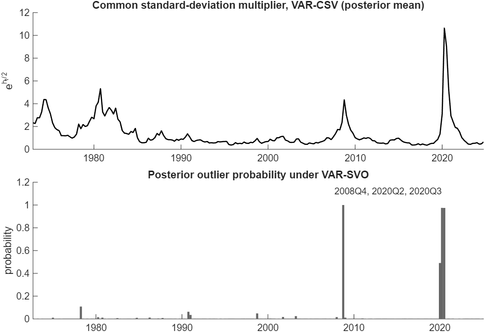

# Which Stochastic Volatility Specification Should My VAR Use?

*Code: [`build.m`](build.m) and [`your_data.m`](your_data.m), which call
[`run_ml`](../../replications/chan2023_joe_mlvarsv/run_ml.m) of the Chan (2023) replication
package and the estimators in [`core/+bvar/+ml`](../../core/+bvar/+ml). Method:
[Chan (2023)](../../CITING.md#chan-2023a).*

In this tutorial we compare five ways of modeling the error covariance matrix of a Bayesian VAR
by their marginal likelihoods: constant volatility, one common volatility factor (VAR-CSV), one
volatility process per equation (VAR-SV), a few volatility factors (VAR-FSV), and one volatility
process per equation with an outlier component (VAR-SVO). Chan (2023) estimates these marginal
likelihoods by integrating out the VAR coefficients analytically and the log-volatilities by
adaptive importance sampling. In a five-variable quarterly VAR of the unemployment rate, PCE
inflation, the federal funds rate, financial conditions and GDP growth from 1973 to 2024, the
outlier component fits best at -1008.8, ahead of the Cholesky specification at -1018.7, factor
stochastic volatility at -1022.0 and the common volatility at -1129.7. It marks three quarters as
outliers with probability one or close to it: 2008Q4 and the two pandemic quarters. The
homoskedastic VAR trails the field by 579. Three fifths of the distance between the Cholesky and
the common specification comes from the prior: restricted to one shrinkage hyperparameter for own
and other lags, VAR-SV falls by 65.7.

## Try It Now

Two commands, from the root of the repository:

| Command | What it produces | Time |
|---|---|---|
| `run tutorials/sv_specification/your_data.m` | the comparison on the same five series with short chains, and the exported report | under a minute |
| `run tutorials/sv_specification/build.m` | every number and figure on this page | 14 minutes |

The short demonstration checks that the workflow runs end to end. Its chains are far too short to
rank the specifications, and every number below comes from the full build. Its settings block is
where you point it at your own file.

On this sample the outlier specification has the highest marginal likelihood under these priors.
That ordering is conditional on the variables, the sample, the order of the variables, the priors
and the set of candidates, so the comparison is worth rerunning on any dataset before a
specification is adopted.



*Figure 1: The posterior mean of the common standard-deviation multiplier
$`\mathrm{e}^{h_t/2}`$ under VAR-CSV (top) and the posterior probability that a quarter is an
outlier under VAR-SVO (bottom), 1973Q1 to 2024Q4. The two panels come from two models, so the
figure shows which quarters each one marks and leaves open what either would do without the
other's component. The multiplier runs from 0.36 in 2018Q2 to 10.64 in 2020Q2; the outlier
probability passes one half in 2008Q4, 2020Q2 and 2020Q3.*

## The Five Specifications

All five models have the same conditional mean, a reduced-form VAR with $`p`$ lags,

$$\mathbf{y}_t = \mathbf{a}_0 + A_1\mathbf{y}_{t-1} + \cdots + A_p\mathbf{y}_{t-p} + \boldsymbol{\varepsilon}_t, \qquad \boldsymbol{\varepsilon}_t \sim N(\mathbf{0}, \Sigma_t),$$

and differ in the covariance matrix $`\Sigma_t`$ of the innovations and in the prior on the VAR
coefficients. Write $`D_t = \mathrm{diag}(\mathrm{e}^{h_{1t}}, \ldots, \mathrm{e}^{h_{nt}})`$ for a
diagonal matrix of volatilities.

| Model | Error covariance | Volatility processes | Shrinkage hyperparameters |
|---|---|---|---|
| VAR | $`\Sigma`$ | none | own lag = other lag, fixed |
| VAR-CSV | $`\mathrm{e}^{h_t}\Sigma`$ | 1 | own lag = other lag, estimated |
| VAR-SV | $`\Sigma_t^{-1} = B_0'D_t^{-1}B_0`$ | $`n`$ | own lags, other lags, impact matrix |
| VAR-FSV | $`\Sigma_t = LG_tL' + D_t`$ | $`n + r`$ | own lags, other lags |
| VAR-SVO | $`\Sigma_t^{-1} = o_t^{-2}B_0'D_t^{-1}B_0`$ | $`n`$, and an outlier scale | own lags, other lags, impact matrix |

The homoskedastic VAR holds $`\Sigma_t = \Sigma`$ over the whole sample. It has a natural
conjugate prior on the coefficients and the covariance matrix, which makes its marginal
likelihood available in closed form.

VAR-CSV (Carriero, Clark and Marcellino, 2016) scales one covariance matrix by a common
volatility, $`\Sigma_t = \mathrm{e}^{h_t}\Sigma`$, where the log-volatility follows a stationary
AR(1) process $`h_t = \phi h_{t-1} + u_t^h`$ with $`u_t^h \sim N(0,\sigma^2)`$. Its unconditional
mean is zero for identification, since the level of the volatility is absorbed by $`\Sigma`$. All
error variances then move in proportion, and the correlations are constant. The natural conjugate
prior keeps estimation fast even for large $`n`$.

VAR-SV, the Cholesky stochastic volatility of Cogley and Sargent (2005) and Carriero, Clark and
Marcellino (2019), gives each equation its own volatility: $`\Sigma_t^{-1} = B_0'D_t^{-1}B_0`$,
where $`B_0`$ is lower triangular with ones on the diagonal, and each $`h_{it}`$ follows an AR(1)
process with its own mean, persistence and variance. The $`n`$ volatilities let the variances and
the correlations move separately.

VAR-FSV takes the innovations to load on $`r`$ latent factors, $`\boldsymbol{\varepsilon}_t =
L\mathbf{f}_t + \mathbf{u}_t`$, where $`\mathbf{u}_t \sim N(\mathbf{0}, D_t)`$ and
$`\mathbf{f}_t \sim N(\mathbf{0}, G_t)`$ are independent, $`L`$ is $`n\times r`$ and lower
triangular with ones on the diagonal, and $`G_t`$ collects $`r`$ further volatilities. The
covariance $`\Sigma_t = LG_tL' + D_t`$ is driven by $`n + r`$ volatility processes.

VAR-SVO extends VAR-SV with the outlier component of Stock and Watson (2016), which Carriero,
Clark, Marcellino and Mertens (2024) use for the pandemic observations. A scale $`o_t`$ multiplies
the innovations, so $`o_t^2`$ multiplies the covariance matrix: $`o_t = 1`$ with probability
$`1 - p_o`$, and with probability $`p_o`$ it is drawn from a uniform distribution on $`(2, 20)`$,
discretized to 31 points. The outlier probability has a $`B(2.5, 37.5)`$ prior, calibrated to one
outlier every four years in quarterly data. Section 14.2 of *Bayesian Macroeconometrics* gives
the same component to VAR-CSV.

Both $`B_0`$ and $`L`$ are unit lower triangular, so the order of the variables is part of each
specification. In VAR-FSV the first $`r`$ variables carry a loading of one, which fixes the scale
of the factors; we order the unemployment rate first, so the first factor is normalized on a real
variable, PCE inflation second for a nominal one, and GDP growth last, whose pandemic quarters
are the most extreme in the panel. The section on checking the estimates reports what that last
choice is worth.

The priors on the VAR coefficients differ with the specification, and the difference matters for
the comparison. The VAR and VAR-CSV use the natural conjugate prior, whose Kronecker structure
gives the analytical results that make them fast, and which shrinks the coefficients on own and
other lags by the same amount. The other three specifications have independent priors across
equations, which allows two shrinkage hyperparameters, one for own lags and one for lags of other
variables. Every shrinkage hyperparameter except the one of the homoskedastic VAR is estimated
with the model, under a gamma prior. We return to this difference below.

## Results for a Five-Variable VAR

The data are the quarterly panel of *Bayesian Macroeconometrics*: real GDP growth, PCE inflation,
the federal funds rate and the unemployment rate, the four series of its chapters 12 and 13,
together with the Chicago Fed's National Financial Conditions Index, which its growth-at-risk
application in Section 4.1.3 pairs with GDP growth. Growth and inflation are annualized quarterly
rates, the two rates and the NFCI are levels, positive values of the NFCI meaning tighter
financial conditions than average, and no further scaling is needed. The NFCI begins in 1971Q1,
which sets the sample at 216 quarters to 2024Q4. The VAR has four lags and the first eight
quarters serve as initial conditions, so the estimation sample runs from 1973Q1 to 2024Q4, with
$`T = 208`$. Every prior mean is zero, as in the book's own script for these series.

The priors, the lag length and the sampler settings are those of Section 5 of Chan (2023): the
shrinkage hyperparameters are estimated with the model, each chain keeps 20,000 draws after a
burn-in of 1,000, and each marginal likelihood uses an importance sample of 10,000 draws. Section
13.1.4 of the book compares three of these specifications on the four macro series by recursive
one-step-ahead forecasts of inflation; here we compare five of them, with financial conditions
added, by marginal likelihood.

*Table 1: Log marginal likelihoods of the five-variable VAR, with numerical standard errors. The
last column is the difference from the best specification. VAR-NCP has no standard error: its
marginal likelihood is available in closed form.*

| Model | Log marginal likelihood | Numerical standard error | Difference |
|---|---|---|---|
| VAR-NCP | -1587.4 | | -578.6 |
| VAR-CSV | -1129.7 | 0.08 | -120.9 |
| VAR-SV | -1018.7 | 0.33 | -9.9 |
| VAR-FSV, $`r = 1`$ | -1022.0 | 0.33 | -13.2 |
| VAR-FSV, $`r = 2`$ | -1026.8 | 0.51 | -18.0 |
| VAR-SVO | -1008.8 | 0.31 | |

We note three results in the table. First, time-varying volatility matters far more than the
choice among its forms: the homoskedastic VAR trails the common volatility by 458 and the best
specification by 579. Second, the three flexible specifications beat the common volatility by 103
to 121, so one volatility process is too restrictive for these five series. Third, adding the
outlier component to the Cholesky specification raises the log marginal likelihood by 9.9,
against numerical standard errors of 0.31 and 0.33, in a sample where GDP growth falls by 33 and
rises by 30 in successive quarters.

The marginal likelihood also ranks the number of factors, and one factor beats two by 4.8. At
five variables both counts satisfy the identification condition $`r \leqslant (n-1)/2`$ of
Anderson and Rubin (1956) that Chan (2023) adopts. In the larger systems of Chan (2023) the
preferred number of factors rises with the dimension.

## How the Marginal Likelihood Is Estimated

The marginal likelihood is the density of the data under a model with all parameters integrated
out. For these models it is a high-dimensional integral over the VAR coefficients, the
log-volatilities, the latent factors and the remaining parameters, and Chan (2023) estimates it
by combining two variance-reduction techniques.

The first is conditional Monte Carlo. Given the log-volatilities and the parameters of the
covariance structure, the VAR coefficients enter a linear regression with a conjugate prior, and
for VAR-FSV the latent factors are Gaussian, so both can be integrated out analytically. What
remains is an integrated likelihood $`p(\mathbf{y}\mid\mathbf{h},\theta)`$ that can be evaluated
without simulating the VAR coefficients, which removes their contribution to the variance of the
estimate. In a large system they are the bulk of the parameters, so that contribution is the bulk
of the variance.

The second is adaptive importance sampling. The log-volatilities and the remaining parameters are
drawn from an importance density fitted to the posterior draws by the cross-entropy method of
Chan and Eisenstat (2015): a Gaussian density for each log-volatility path, parameterized as an
AR(1) process with time-varying intercepts and variances, and normal, truncated normal and gamma
densities for the other blocks. The $`M`$ weights are split into 50 batches, the estimate averages
the log of the mean weight within each batch, and their spread across batches gives the numerical
standard error. Sections 5.1.4 and 11.1.3 of *Bayesian Macroeconometrics* apply the same two
ideas to an autoregression with $`t`$ errors and to a static factor model.

## Is It the Volatility or the Prior?

The five specifications differ in their priors as well as their likelihoods, and the two effects
can be separated. VAR-SV, VAR-FSV and VAR-SVO allow two shrinkage hyperparameters, one for own
lags and one for the lags of other variables, while the natural conjugate prior of the
homoskedastic VAR and VAR-CSV has a single one. Restricting VAR-SV to a single hyperparameter
gives the symmetric prior in Table 2.

*Table 2: Posterior means and standard deviations of the shrinkage hyperparameters. The symmetric
prior restricts the own-lag and other-lag hyperparameters to be equal, and VAR-CSV has one
hyperparameter for all lags.*

| Model | Log marginal likelihood | Own lags | Other lags | Impact matrix |
|---|---|---|---|---|
| VAR-CSV | -1129.7 | 0.346 (0.075) | 0.346 (0.075) | |
| VAR-SV, symmetric prior | -1084.3 | 0.0706 (0.012) | 0.0706 (0.012) | 0.0929 (0.061) |
| VAR-SV | -1018.7 | 0.244 (0.058) | 0.00090 (0.00054) | 0.096 (0.063) |
| VAR-FSV, $`r = 1`$ | -1022.0 | 0.251 (0.059) | 0.00099 (0.00053) | |
| VAR-FSV, $`r = 2`$ | -1026.8 | 0.251 (0.059) | 0.00101 (0.00056) | |
| VAR-SVO | -1008.8 | 0.25 (0.058) | 0.00121 (0.00065) | 0.0912 (0.072) |

The restriction costs VAR-SV 65.7 in log marginal likelihood, and the estimated hyperparameters
show why: the own-lag hyperparameter is about 270 times the other-lag one, a difference the
symmetric prior cannot express. That is three fifths of the 111 that separates VAR-SV from
VAR-CSV, so cross-variable shrinkage carries much of the comparison. The other two fifths is what
remains between two model-prior configurations that differ in more than their volatility
processes: VAR-CSV has the natural conjugate prior, whose Kronecker structure ties the prior on
the coefficients to the error covariance matrix, while VAR-SV has independent priors across
equations and a further hyperparameter for the impact matrix. Reading it as a pure volatility
effect would need the two priors matched first. In the 15-variable system of Chan (2023), where
the number of cross-variable coefficients is far larger, cross-variable shrinkage accounts for
nearly all of the difference, and VAR-SV under the symmetric prior fits slightly worse than
VAR-CSV (Table 3 of the paper).

## What the Outlier Component Picks Up

The outlier component gives each quarter a scale $`o_t`$ whose square multiplies the covariance
matrix, with a prior frequency of one outlier every four years. Two summaries describe how often
the data want one. The outlier probability $`p_o`$ has a posterior mean of 0.026, under half the
prior mean. The expected number of outlier quarters, the sum of the posterior probabilities that
$`o_t > 1`$, is 4.0 of 208. The beta posterior of $`p_o`$ ties the two together as
$`(2.5 + 4.0)/(40 + 208) = 0.026`$.

Three quarters carry almost all of that. The component marks 2008Q4 with probability 1.00 and a
posterior mean scale of 7.7, and the two pandemic quarters 2020Q2 and 2020Q3 with probabilities
0.98 and 0.97 and scales of 13.3 and 11.5. Since the covariance matrix is multiplied by
$`o_t^2`$, those three quarters carry about 59, 177 and 132 times the covariance the same model
gives an ordinary quarter. Figure 1 shows the whole path beside the common volatility of VAR-CSV,
which runs from 0.36 in 2018Q2 to 10.64 in 2020Q2.

Carriero, Clark, Marcellino and Mertens (2024) designed the component to keep such quarters from
lifting the persistent volatility, and Section 14.2 of *Bayesian Macroeconometrics* fits it to
the common volatility of a 25-variable monthly panel. Here it also raises the log marginal
likelihood by 9.9 over the same specification without it, which is what one would expect in a
sample whose largest observations are as extreme as these.

## Checking the Estimates

Three checks decide whether the ranking in Table 1 can be read at face value. The first is the
numerical standard error of each estimate, which comes from 50 batches of importance weights and
runs from 0.08 to 0.51. The weights correct for whatever the fitted density gets wrong, so the
estimator targets the same marginal likelihood as long as that density covers the target. How
reliable a finite run is depends on the fit: a density that misses a region can leave both the
estimate and its batch standard error too small.

The second check is a repeat of every run from a second seed, which redraws the chain, refits the
importance density and redraws the weights, together with two summaries of how concentrated those
weights are.

*Table 3: Every specification estimated twice, from two seeds.*

| Model | Log ML, seed 1 | Log ML, seed 2 | Difference | Standard error |
|---|---|---|---|---|
| VAR-NCP | -1587.4 | -1587.4 | 0.0 | |
| VAR-CSV | -1129.7 | -1129.7 | -0.1 | 0.08 |
| VAR-SV | -1018.7 | -1019.0 | -0.3 | 0.33 |
| VAR-SV, symmetric prior | -1084.3 | -1085.0 | -0.7 | 0.35 |
| VAR-FSV, $`r = 1`$ | -1022.0 | -1022.6 | -0.6 | 0.33 |
| VAR-FSV, $`r = 2`$ | -1026.8 | -1026.7 | 0.1 | 0.51 |
| VAR-SVO | -1008.8 | -1008.2 | 0.6 | 0.31 |

No estimate moves by more than 0.7 between seeds, which leaves the ordering of Table 1 and each
of its gaps intact. The differences are of the same size as the batch standard errors, which is
what a well-behaved importance sample gives. A comparison that turned on a log point or two would
need a longer importance sample, a better-fitting density, or both.

The order of the variables matters for VAR-FSV for two related reasons. The first $`r`$ variables
identify the scales of the factors, since their loadings are fixed at one, and the model has no
outlier component, so every extreme observation has to be absorbed by its volatility processes.
Put GDP growth in the first position and the factor has to follow it through 2020Q2 and 2020Q3,
when growth falls by 33 and rises by 30: the factor's own volatility process has to swing for two
observations, and how much of that movement belongs to the factor and how much to GDP growth's
idiosyncratic volatility is poorly determined, since the unit loading ties the two together.
`build.m` estimates the one-factor model once more with GDP growth moved to the front. The same
model and the same two seeds then give -1053.4 and -1044.3, 9.1 apart, against 0.6 apart in the
order this page uses.

Ordering the series with the largest observations last leaves the factors normalized on series
whose extremes are milder, which is a matter of degree: every series here has quarters that stand
out, and the 2020 pair in GDP growth is the most extreme of them. VAR-SVO handles those quarters
with a component built for them. The normalization lies behind the dependence of VAR-SV and
VAR-SVO on the order of the variables that [tutorial 1](../variable_ordering/) measures as well.

The third check is how well the chains that fit those importance densities mix. The next table
gives inefficiency factors at a truncation lag of 200, computed with `bvar.diag`, over the
hyperparameters, and the count of parameters whose Geweke statistic rejects at the 5% level.

*Table 4: Inefficiency factors by parameter group, and the number of parameters whose Geweke
statistic rejects at the 5% level, from 20,000 draws.*

| Model | $`\kappa`$ | $`\mu`$ | $`\phi`$ | $`\sigma^2`$ | Geweke rejections |
|---|---|---|---|---|---|
| VAR-CSV | 62 | | 4 | 24 | 2 of 3 |
| VAR-SV | 1 to 26 | 1 to 2 | 4 to 16 | 17 to 52 | 8 of 18 |
| VAR-SV, symmetric prior | 1 to 3 | 1 to 2 | 4 to 9 | 19 to 40 | 6 of 18 |
| VAR-FSV, $`r = 1`$ | 4 to 37 | 1 to 29 | 5 to 12 | 26 to 43 | 5 of 20 |
| VAR-FSV, $`r = 2`$ | 4 to 32 | 1 to 25 | 5 to 29 | 33 to 68 | 5 of 23 |
| VAR-SVO | 2 to 18 | 1 to 2 | 9 to 17 | 29 to 99 | 2 of 18 |

The volatility parameters are the slow ones. An inefficiency factor of 100 means that 20,000
draws carry the information of 200 independent ones, which suffices for fitting the importance
density and is thin for a posterior standard deviation of $`\sigma_i^2`$. Geweke's statistic
rejects for 28 of the 100 hyperparameters, and the log-volatility variances account for 13 of
those and the persistences for 8, so a chain several times longer is worth running before quoting
posterior summaries of those two blocks. Section 6.5 of *Bayesian Macroeconometrics* sets out all
three diagnostics, and [ex13](../../examples/ex13_mcmc_diagnostics.m) applies them to a VAR-SV
sampler in detail.

## Applying the Method to Your Data

The script [`your_data.m`](your_data.m) runs the same comparison on any dataset. Set the file,
the columns by name, which of them to rescale, the date column, the numbers of factors and the
chain lengths in its settings block. It drops rows missing at either end of the sample, and stops
on a missing value inside it, on unevenly spaced dates and on a constant series. With its
defaults it compares seven specifications on the five series of this page with short chains, in
well under a minute, and prints the log marginal likelihoods and the quarters the outlier
component picks out. One call estimates a model and its marginal likelihood:

```matlab
out = run_ml('VAR-SV', false, false, nsim, burnin, seed, [], 'data', data, 'r', r, 'M', M);
```

Here `data` holds the series in columns, oldest first, with the first eight rows as initial
conditions; `out.lml` and `out.lmlstd` are the log marginal likelihood and its numerical standard
error. The second and third arguments hold the shrinkage hyperparameters fixed and impose the
symmetric prior, and `'r'` sets the number of factors of VAR-FSV. The lag length is four and the
first eight rows are the initial conditions, as in Chan (2023), so data of another frequency
should be aggregated to quarters, as `your_data.m` does with its `rows = "months"` setting. The
order of the columns is part of the Cholesky and factor specifications, so it is worth choosing
deliberately and repeating the comparison from a second seed.

The script writes the comparison to `outdir`, which defaults to `tempdir` so that a run leaves
the repository unchanged. `sv_specification_report_models.csv` holds one row per specification
with its log marginal likelihood, numerical standard error and running time,
`sv_specification_report_outliers.csv` the posterior outlier probability and the posterior mean
of the multiplier $`o_t`$ for each period, and `sv_specification_report.mat` both tables together
with the settings behind them, including the prior hyperparameters and the posterior mean of the
shrinkage hyperparameters of each model. Setting `outdir = ''` turns the export off.

## Implementations in R and Python

The book repository
[bayesian-macroeconometrics](https://github.com/joshuaccchan/bayesian-macroeconometrics)
implements the samplers of these models in MATLAB, R and Python: `chapter13/pred_VAR_SV` and
`pred_VAR_OISV` for the Cholesky specification and its order-invariant variant on these same
four macro series, `chapter14/pred_largeVAR_CSV`, `pred_largeVAR_SV` and `pred_largeVAR_FSV` for
the three specifications in a larger system, and `chapter14/VAR_CSV_o` for a common volatility
with an outlier component. `chapter11/SFM_CE` computes a marginal likelihood that combines an
integrated likelihood with the cross-entropy method. Those are samplers and examples of the
ingredients; none of them reproduces the comparison on this page.
[`RELATED.md`](../../RELATED.md) lists the R and Python counterparts of the other models in this
repository.

## Reproducing the Results

To reproduce all results on this page, run the build script from the root of the repository:

```matlab
run tutorials/sv_specification/build.m
```

The seven specifications are each estimated twice, and `build.m` saves every run in a `runs`
folder next to itself, so an interrupted build resumes where it stopped. Setting `build_runs` to
a subset of 1:7 before running the script computes only those specifications, which spreads them
over several MATLAB sessions. The computation took 12.8 minutes using MATLAB R2025b on a
computer with an Intel Core Ultra 7 255U processor and 32 GB of RAM. The script prints every
result in this tutorial and saves the figure in the same folder as this page. The
data file [`macro5_Q.csv`](macro5_Q.csv) joins the four series of the book's
`chapter12/macro4_Q.csv` with the NFCI column of its `chapter04/GDP_NFCI_merged.csv` on the
quarter; the two files date a quarter by its last and its first month, and the GDP column they
share is identical in all 260 quarters they have in common.

## References

Anderson, T. W. and Rubin, H. (1956). Statistical Inference in Factor Analysis. In:
*Proceedings of the Third Berkeley Symposium on Mathematical Statistics and Probability*,
Volume 5, 111-150. University of California Press.

Carriero, A., Clark, T. E. and Marcellino, M. (2016). Common Drifting Volatility in Large
Bayesian VARs. *Journal of Business and Economic Statistics*, 34(3): 375-390.
[doi:10.1080/07350015.2015.1040116](https://doi.org/10.1080/07350015.2015.1040116)

Carriero, A., Clark, T. E. and Marcellino, M. (2019). Large Bayesian Vector Autoregressions with
Stochastic Volatility and Non-Conjugate Priors. *Journal of Econometrics*, 212(1): 137-154.
[doi:10.1016/j.jeconom.2019.04.024](https://doi.org/10.1016/j.jeconom.2019.04.024)

Carriero, A., Clark, T. E., Marcellino, M. and Mertens, E. (2024). Addressing COVID-19 Outliers
in BVARs with Stochastic Volatility. *Review of Economics and Statistics*, 106(5): 1403-1417.
[doi:10.1162/rest_a_01213](https://doi.org/10.1162/rest_a_01213)

Chan, J. C. C. (2023). Comparing Stochastic Volatility Specifications for Large Bayesian VARs.
*Journal of Econometrics*, 235(2): 1419-1446.
[doi:10.1016/j.jeconom.2022.11.003](https://doi.org/10.1016/j.jeconom.2022.11.003)

Chan, J. C. C. (forthcoming). *Bayesian Macroeconometrics: Methods and Applications*. Chapman &
Hall/CRC. [Code repository](https://github.com/joshuaccchan/bayesian-macroeconometrics)

Chan, J. C. C. and Eisenstat, E. (2015). Marginal Likelihood Estimation with the Cross-Entropy
Method. *Econometric Reviews*, 34(3): 256-285.
[doi:10.1080/07474938.2014.944474](https://doi.org/10.1080/07474938.2014.944474)

Cogley, T. and Sargent, T. J. (2005). Drifts and Volatilities: Monetary Policies and Outcomes in
the Post WWII US. *Review of Economic Dynamics*, 8(2): 262-302.
[doi:10.1016/j.red.2004.10.009](https://doi.org/10.1016/j.red.2004.10.009)

Stock, J. H. and Watson, M. W. (2016). Core Inflation and Trend Inflation. *Review of Economics
and Statistics*, 98(4): 770-784.
[doi:10.1162/REST_a_00608](https://doi.org/10.1162/REST_a_00608)

The BibTeX entry for Chan (2023) is in [`CITING.md`](../../CITING.md); those for the other papers
are:

```bibtex
@inproceedings{AR56,
  author    = {Anderson, T. W. and Rubin, H.},
  title     = {Statistical Inference in Factor Analysis},
  booktitle = {Proceedings of the Third {Berkeley} Symposium on Mathematical Statistics and Probability},
  volume    = {5},
  pages     = {111--150},
  year      = {1956},
  publisher = {University of California Press}
}

@article{CCM16,
  author  = {Carriero, A. and Clark, T. E. and Marcellino, M.},
  title   = {Common Drifting Volatility in Large {Bayesian} {VARs}},
  journal = {Journal of Business and Economic Statistics},
  year    = {2016},
  volume  = {34},
  number  = {3},
  pages   = {375--390},
  doi     = {10.1080/07350015.2015.1040116}
}

@article{CCM19,
  author  = {Carriero, A. and Clark, T. E. and Marcellino, M.},
  title   = {Large {Bayesian} Vector Autoregressions with Stochastic Volatility and Non-Conjugate Priors},
  journal = {Journal of Econometrics},
  year    = {2019},
  volume  = {212},
  number  = {1},
  pages   = {137--154},
  doi     = {10.1016/j.jeconom.2019.04.024}
}

@article{CCMM24,
  author  = {Carriero, A. and Clark, T. E. and Marcellino, M. and Mertens, E.},
  title   = {Addressing {COVID-19} Outliers in {BVARs} with Stochastic Volatility},
  journal = {Review of Economics and Statistics},
  year    = {2024},
  volume  = {106},
  number  = {5},
  pages   = {1403--1417},
  doi     = {10.1162/rest_a_01213}
}

@article{CE15,
  author  = {Chan, J. C. C. and Eisenstat, E.},
  title   = {Marginal Likelihood Estimation with the Cross-Entropy Method},
  journal = {Econometric Reviews},
  year    = {2015},
  volume  = {34},
  number  = {3},
  pages   = {256--285},
  doi     = {10.1080/07474938.2014.944474}
}

@article{CS05,
  author  = {Cogley, T. and Sargent, T. J.},
  title   = {Drifts and Volatilities: Monetary Policies and Outcomes in the Post {WWII} {US}},
  journal = {Review of Economic Dynamics},
  year    = {2005},
  volume  = {8},
  number  = {2},
  pages   = {262--302},
  doi     = {10.1016/j.red.2004.10.009}
}

@article{SW16,
  author  = {Stock, J. H. and Watson, M. W.},
  title   = {Core Inflation and Trend Inflation},
  journal = {Review of Economics and Statistics},
  year    = {2016},
  volume  = {98},
  number  = {4},
  pages   = {770--784},
  doi     = {10.1162/REST_a_00608}
}
```
