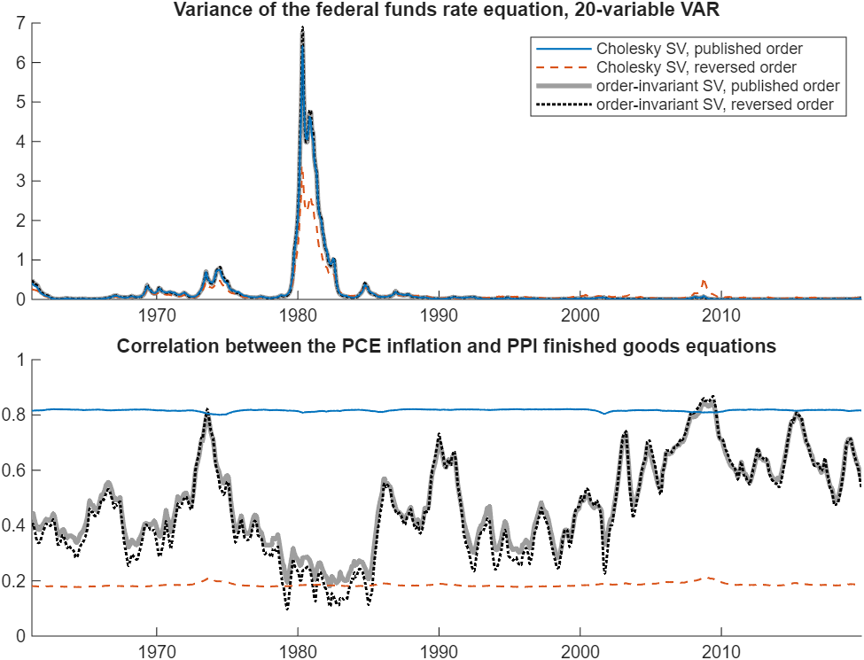
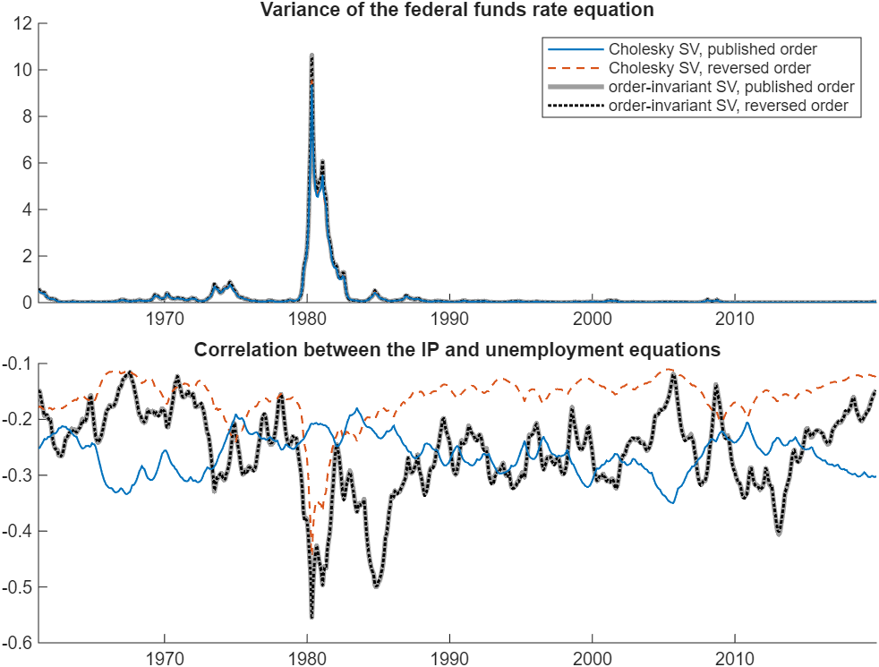
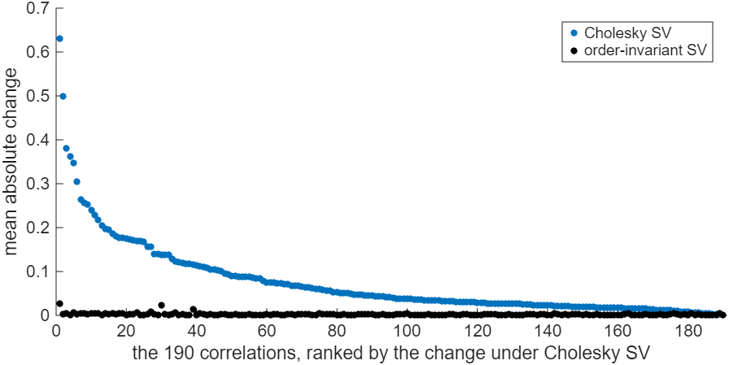

# Does the Order of the Variables Change My VAR Results?

*Code: [`examples/ex06_variable_ordering_sv.m`](../../examples/ex06_variable_ordering_sv.m) and
[`build.m`](build.m). Method:
[Chan, Koop and Yu (2024)](../../CITING.md#chan-koop-and-yu-2024).*

In this tutorial we examine whether the order of the variables affects the estimates and
forecasts of a VAR with stochastic volatility. Under the popular Cholesky specification of
Cogley and Sargent (2005) it does, and the effect is larger in a larger VAR. In the 20-variable
VAR of Chan, Koop and Yu (2024), reversing the order of the variables changes the typical error
variance by 16% of its level and moves the estimated correlation between the PCE inflation and
PPI finished goods equations from about 0.82 to about 0.19 (Figure 1). The order-invariant
specification of Chan, Koop and Yu (2024) gives the same estimates under both orders, up to
Monte Carlo error. The ordering matters much more for density forecasts than for point
forecasts.

## Try It Now

Two commands, from the root of the repository:

| Command | What it produces | Time |
|---|---|---|
| `run tutorials/variable_ordering/your_data.m` | the comparison on the four series of ex06 with short chains | about 30 seconds |
| `run tutorials/variable_ordering/build.m` | every number and figure on this page | about 23 minutes |



*Figure 1: Posterior mean of the variance of the federal funds rate equation (top panel) and the
correlation between the PCE inflation and PPI finished goods equations implied by the posterior
mean of $`\boldsymbol{\Sigma}_t`$ (bottom panel), 20-variable VAR. The solid blue and dashed red
lines are the Cholesky model in the published and reverse orders; the thick gray and dotted
black lines are the order-invariant model in the published and reverse orders.*

## The Ordering Problem

A VAR with stochastic volatility requires a model for the time-varying error covariance matrix
$`\boldsymbol{\Sigma}_t`$. Following Cogley and Sargent (2005), a popular approach decomposes the
precision matrix as

$$\boldsymbol{\Sigma}_t^{-1} = \mathbf{L}'\mathbf{D}_t^{-1}\mathbf{L},$$

where $`\mathbf{D}_t = \mathrm{diag}(\mathrm{e}^{h_{1t}}, \ldots, \mathrm{e}^{h_{nt}})`$ collects
the time-varying variances and $`\mathbf{L}`$ is a unit lower triangular matrix. We refer to this
specification as the Cholesky stochastic volatility model. The main advantage of the triangular
form is computational: conditional on the other parameters, the free elements of $`\mathbf{L}`$
are Gaussian and can be drawn exactly.

The Cholesky stochastic volatility model is not invariant to the order of the variables. As noted
by Carriero, Clark and Marcellino (2019), the order dependence comes from the triangular form
combined with the prior. In applications one typically assumes an identical prior on the
parameters in each equation: the log-volatilities share the same state equation and the free
elements of $`\mathbf{L}`$ have the same prior. Under the triangular form, this prior induces an
unreasonable prior on $`\boldsymbol{\Sigma}_t`$ that depends on the order of the variables. The
variance of the first variable is $`\mathrm{e}^{h_{1t}}`$, whereas the variance of the $`i`$th
variable also depends on the log-volatilities of the $`i-1`$ variables ordered before it, so it is
stochastically larger as $`i`$ increases. For example, under independent standard normal priors on
the free elements of $`\mathbf{L}`$ and $`\mathbf{D}_t = \mathbf{I}_n`$, the prior mean of the
$`i`$th variance is $`2^{i-1}`$ (Chan, Koop and Yu, 2024). The posterior estimates and forecasts
therefore depend on the order as well. Since the implied prior variances grow exponentially with
$`i`$, the problem becomes more serious in larger VARs.

Chan, Koop and Yu (2024) propose an order-invariant specification:

$$\boldsymbol{\Sigma}_t^{-1} = \mathbf{B}_0'\mathbf{D}_t^{-1}\mathbf{B}_0,$$

where $`\mathbf{B}_0`$ is an unrestricted nonsingular matrix and each log-volatility follows a
stationary AR(1) process with zero mean. They show that the stochastic volatility identifies
$`\mathbf{B}_0`$ up to permutations and sign changes of its rows, and prove that the model is
invariant to the order of the variables. With a prior on $`\mathbf{B}_0`$ centered at the identity
matrix and with the same variance for every element, the prior is order invariant as well. They
also develop an MCMC algorithm for estimation and forecasting. Without the triangular restriction,
the conditional distribution of each row of $`\mathbf{B}_0`$ is non-Gaussian, and the rows are
drawn one at a time using the algorithm of Waggoner and Zha (2003), as extended by Villani (2009)
to priors with nonzero means, which preserves the equation-by-equation structure of the sampler.

Arias, Rubio-Ramírez and Shin (2023) document the implications of the ordering for forecasts
from the time-varying parameter VAR with Cholesky stochastic volatility. They find that the
ordering does not affect point forecasts, that the dispersion of the predictive densities can
differ substantially across orderings, and that the best ordering for one variable is not
necessarily the best for another.

Since reordering the variables of the order-invariant model gives the same model, two runs of it
under different orders differ only by Monte Carlo error. For the Cholesky model, a difference
between two orders reflects the ordering when it exceeds the Monte Carlo error of the model.

## Results for a Four-Variable VAR

We estimate both models using four monthly FRED-MD series (McCracken and Ng, 2016): industrial
production (IP), the unemployment rate, PCE inflation and the federal funds rate. The sample runs
from 1959:03 to 2019:12, the first 24 months serve as initial conditions, and the VAR has 13 lags.
Each model is estimated with the variables in the published order and in the reverse order. Each
model is also estimated a second time in the published order with a different seed, which shows
how much the estimates change from Monte Carlo error alone. The four-variable results are based on
30,000 posterior draws after a burn-in period of 5,000 draws, the settings of the full-sample
estimation in the replication package.

Table 1 reports how much the estimated paths change, on average over 1961:03–2019:12, when the
order of the variables is reversed and when only the seed is changed. The variances are
posterior means. The correlations are computed from the posterior mean of
$`\boldsymbol{\Sigma}_t`$, which in general differs from the posterior mean of the correlation.

*Table 1: Average absolute difference between the paths from the baseline run (published order,
first seed) and from a run with the order reversed or with a different seed, four-variable VAR.
Variances are in percent of their level and correlations in correlation points.*

| | Cholesky, order reversed | Cholesky, seed changed | Order-invariant, order reversed | Order-invariant, seed changed |
|---|---|---|---|---|
| var(IP) | 4.1% | 0.3% | 0.6% | 0.8% |
| var(unemployment) | 7.7% | 0.4% | 0.4% | 0.8% |
| var(PCE inflation) | 0.9% | 0.3% | 0.5% | 0.7% |
| var(fed funds) | 1.7% | 0.8% | 1.1% | 1.2% |
| corr(IP, unemployment) | 0.111 | 0.001 | 0.001 | 0.001 |
| corr(IP, PCE inflation) | 0.067 | 0.000 | 0.000 | 0.001 |
| corr(IP, fed funds) | 0.088 | 0.000 | 0.001 | 0.001 |
| corr(unemployment, PCE inflation) | 0.004 | 0.000 | 0.001 | 0.000 |
| corr(unemployment, fed funds) | 0.086 | 0.000 | 0.001 | 0.001 |
| corr(PCE inflation, fed funds) | 0.022 | 0.000 | 0.000 | 0.001 |

We note three features of Table 1. First, reversing the order changes four of the six correlations
of the Cholesky model by 0.07 to 0.11, whereas changing the seed changes them by 0.001 or less.
Second, the variances of the Cholesky model change by only 1% to 8%. Third, reversing the order
changes the paths of the order-invariant model by about as much as changing the seed.

Figure 2 reports two of these paths. The bottom panel shows that the two orders of the Cholesky
model imply different histories of the correlation between IP and unemployment, and neither
follows the estimate of the order-invariant model, which is the same under both orders. In the
top panel, the four estimates of the variance of the federal funds rate equation are nearly
identical.



*Figure 2: Posterior mean of the variance of the federal funds rate equation (top panel) and the
correlation between the IP and unemployment equations implied by the posterior mean of
$`\boldsymbol{\Sigma}_t`$ (bottom panel), four-variable VAR. The lines are as in Figure 1.*

## Results for a 20-Variable VAR

The replication package contains the posterior means of $`\boldsymbol{\Sigma}_t`$ from the
20-variable VAR in Chan, Koop and Yu (2024), for both models under both orders. The four variables
above, which Chan, Koop and Yu (2024) call the core variables, are ordered first, and the
remaining 16 follow the order in Carriero, Clark and Marcellino (2019). Table 2 summarizes the
differences between the two orders over all 20 variances and 190 correlations.

*Table 2: Average absolute differences between the paths under the published and reverse orders,
20-variable VAR. Variances are posterior means, in percent of their level; correlations are
computed from the posterior mean of $`\boldsymbol{\Sigma}_t`$, in correlation points.*

| | Cholesky | Order-invariant |
|---|---|---|
| Variances, median | 16.3% | 1.0% |
| Variances, largest | 107.0% | 5.1% |
| Correlations, median | 0.041 | 0.002 |
| Correlations, 90th percentile | 0.176 | 0.004 |
| Correlations, largest | 0.631 | 0.026 |

Table 2 shows that the ordering has a much larger effect in the 20-variable VAR. Under the
Cholesky model, the typical variance changes by 16% of its level, and the variance of the
federal funds rate equation by 54%, compared with 1.7% in the four-variable VAR. Figure 1 shows
that in the reverse order the peak of this variance is about half that of the other three
estimates. The largest change is in the correlation between PCE inflation and PPI finished
goods. Under the Cholesky model this correlation is nearly constant over time, and its level is
determined by the ordering: about 0.82 in the published order and 0.19 in the reverse order.
Under the order-invariant model it varies over time, and the two orders agree up to Monte Carlo
error.

For the four core variables, the correlations of the Cholesky model change by amounts similar to
or smaller than those in the four-variable VAR, for example 0.119 for IP and unemployment compared
with 0.111, and 0.039 for IP and PCE inflation compared with 0.067. The difference between the two
VARs lies in the variances and in the correlations with the other 16 variables.

For the Cholesky model, 131 of the 190 correlations (Figure 3) and 18 of the 20 variances change
by more than the largest change under the order-invariant model. The replication package contains
one run per order, so the Monte Carlo error of the order-invariant model serves as the benchmark.



*Figure 3: Average absolute change in each of the 190 correlation paths, computed from the
posterior mean of $`\boldsymbol{\Sigma}_t`$, when the order of the variables is reversed,
20-variable VAR. The correlations are ranked by the change under the Cholesky model (blue); the
black dots are the changes under the order-invariant model.*

## Forecast Performance

The replication package also contains the recursive forecasts of the 20-variable VAR in Chan, Koop
and Yu (2024), evaluated from 1970:03 to the end of the sample. From these forecasts we recompute
the root mean squared forecast errors (RMSFEs) and average log predictive likelihoods (ALPLs) of
the four core variables. Lower RMSFEs and higher ALPLs indicate better point and density
forecasts, respectively. Table 3 reports the ALPLs one month ahead, and Table 4 reports all
results.

*Table 3: ALPLs one month ahead. The symbols \*, \*\* and \*\*\* denote significance at the 10%,
5% and 1% levels in a two-sided Diebold-Mariano test against the Cholesky model in the published
order.*

| Model | IP | Unemployment | PCE inflation | Fed funds |
|---|---|---|---|---|
| Cholesky, published order | 2.071 | -0.005 | 2.210 | 0.222 |
| Cholesky, reverse order | 1.522*** | -0.124 | 1.811*** | -0.327*** |
| Order-invariant, published order | 3.660*** | 0.463*** | 4.821*** | 0.294*** |
| Order-invariant, reverse order | 3.659*** | 0.463*** | 4.823*** | 0.296*** |

<details> <summary>Table 4: RMSFEs and ALPLs of the four core variables at horizons h = 1, 6 and
12 months</summary>

The symbols \*, \*\* and \*\*\* denote significance at the 10%, 5% and 1% levels in a two-sided
Diebold-Mariano test against the Cholesky model in the published order.

| Variable | Model | RMSFE h=1 | RMSFE h=6 | RMSFE h=12 | ALPL h=1 | ALPL h=6 | ALPL h=12 |
|---|---|---|---|---|---|---|---|
| IP | Cholesky, published order | 0.006954 | 0.007195 | 0.007261 | 2.071 | 2.159 | 2.266 |
| IP | Cholesky, reverse order | 0.007095** | 0.00729** | 0.007323** | 1.522*** | 1.651*** | 1.767*** |
| IP | Order-invariant, published order | 0.006796 | 0.007299 | 0.007486*** | 3.660*** | 3.458*** | 3.360*** |
| IP | Order-invariant, reverse order | 0.00681 | 0.007286 | 0.007493*** | 3.659*** | 3.459*** | 3.358*** |
| Unemployment | Cholesky, published order | 0.159 | 0.1692 | 0.1729 | -0.005 | -0.689 | -0.707 |
| Unemployment | Cholesky, reverse order | 0.1581 | 0.1686 | 0.173 | -0.124 | -0.761 | -0.742 |
| Unemployment | Order-invariant, published order | 0.1579 | 0.167 | 0.1728 | 0.463*** | 0.276 | 0.152 |
| Unemployment | Order-invariant, reverse order | 0.1579 | 0.1671* | 0.1728 | 0.463*** | 0.276 | 0.156 |
| PCE inflation | Cholesky, published order | 0.001955 | 0.001986 | 0.001983 | 2.210 | 2.311 | 2.425 |
| PCE inflation | Cholesky, reverse order | 0.001969*** | 0.001987 | 0.001986 | 1.811*** | 1.919*** | 2.024*** |
| PCE inflation | Order-invariant, published order | 0.001818** | 0.001989 | 0.001986* | 4.821*** | 4.448*** | 4.249*** |
| PCE inflation | Order-invariant, reverse order | 0.001819** | 0.001989 | 0.001986 | 4.823*** | 4.453*** | 4.260*** |
| Fed funds | Cholesky, published order | 0.4924 | 1.566 | 2.216 | 0.222 | -8.473 | -16.704 |
| Fed funds | Cholesky, reverse order | 0.4966 | 1.597* | 2.264 | -0.327*** | -6.708*** | -12.474*** |
| Fed funds | Order-invariant, published order | 0.4925 | 1.576 | 2.233 | 0.294*** | -6.956* | -13.466* |
| Fed funds | Order-invariant, reverse order | 0.494 | 1.57 | 2.236 | 0.296*** | -7.039 | -13.662 |

</details>

Table 4 shows that the ordering has little effect on point forecasts, which depend mainly on the
VAR coefficients, in line with Arias, Rubio-Ramírez and Shin (2023). The RMSFEs of the two orders
of the Cholesky model differ by at most 2.1% across variables and horizons, and those of the two
orders of the order-invariant model by at most 0.4%. In contrast, density forecasts are sensitive
to the ordering. One month ahead, reversing the order lowers the ALPL of the Cholesky model for
all four variables, by 0.12 to 0.55 (Table 3). The ALPLs of the two orders of the order-invariant
model agree to within 0.011, except for the federal funds rate six and twelve months ahead, where
they differ by 0.08 and 0.20. These differences are Monte Carlo error.

The order-invariant model produces the best density forecasts of IP, unemployment and PCE
inflation at all horizons, and of the federal funds rate one month ahead. The exception is the
federal funds rate six and twelve months ahead, where the Cholesky model in the reverse order
performs best. For point forecasts of IP twelve months ahead, the RMSFE of the order-invariant
model is 3% higher than that of the Cholesky model in the published order, and the difference is
statistically significant. Under the Cholesky model, the published order gives better density
forecasts of IP, unemployment and PCE inflation, and the reverse order better density forecasts of
the federal funds rate six and twelve months ahead. Chan, Koop and Yu (2024) and Arias,
Rubio-Ramírez and Shin (2023) reach the same conclusion: the best ordering differs across
variables.

## Applying the Order-Invariant Model to Other Data

The script [`your_data.m`](your_data.m) in this folder runs the comparison on any dataset. Set the
file, the columns, their names, the date column, the lag length and the chain length at the top of
the script. Column numbers count every column of the file. The script drops rows missing at either
end of the sample, and stops on a missing value inside it, on unevenly spaced dates when a date
column is given, and on a constant series. It estimates both models with the variables in the
order given and in the reverse order, reports how much each correlation changes, and plots the
correlation that changes most under the Cholesky model. With the default settings, which use the
four series of ex06 and chains of 1,000 draws, it runs in about 30 seconds.

Both models are estimated by the function `bvar.models.var_sv`:

```matlab
res = bvar.models.var_sv(Y0, Y, p, 'model', 'OI', 'nsim', 30000, 'burnin', 5000, 'seed', 1);
```

The matrix `Y` is $`T \times n`$, with each variable transformed to be stationary and no missing
values, and `Y0` contains at least $`\max(p, 4)`$ earlier observations that serve as initial
conditions. Setting `'model'` to `'CS'` gives the Cholesky model. The prior is that of Chan, Koop
and Yu (2024), and the output contains the posterior means of $`\boldsymbol{\Sigma}_t`$, the VAR
coefficients, the log-volatilities and $`\mathbf{B}_0`$, or $`\mathbf{L}`$ under the Cholesky
model. We recommend the chain length of the replication package, 30,000 draws after a burn-in
period of 5,000 draws, and a second run with a different seed to see how much the estimates change
from Monte Carlo error alone.

The sampler draws $`\mathbf{B}_0`$ row by row with the algorithm of Waggoner and Zha (2003) and
Villani (2009), using `bvar.structural.b0_row_sampler`, the VAR coefficients using
`bvar.samplers.eq_var_oi`, each log-volatility path using `bvar.sv.ksc_ar1_mean` and its
parameters using `bvar.sv.sv0_params`. The shrinkage hyperparameters of the Minnesota-type
horseshoe prior on the VAR coefficients are drawn using `bvar.samplers.horseshoe_kappa_psi`. To
reproduce the 20-variable estimation in Chan, Koop and Yu (2024), call
`run_all('OI', flip, 30000, 5000, seed)` in `replications/chan_koop_yu2024_jbes_oisv/`, where
`flip = 1` reverses the order.

## Implementations in R and Python

The book repository
[bayesian-macroeconometrics](https://github.com/joshuaccchan/bayesian-macroeconometrics) contains
both covariance specifications in MATLAB, R and Python, each with an independent Minnesota prior
on the VAR coefficients. The script `chapter13/pred_VAR_SV` implements the Cholesky model with
random-walk log-volatilities, and `chapter13/pred_VAR_OISV` the order-invariant model. The script
`chapter13/compare_VAR_SV` compares the two with a homoskedastic VAR in recursive one-step-ahead
forecasts of PCE inflation. These programs are separate from ex06, whose Cholesky model has
stationary AR(1) log-volatilities with estimated means.

## Reproducing the Results

For a quick version of the four-variable comparison, run ex06 with its default chains of 1,000
draws after a burn-in period of 200 draws, which takes about 35 seconds. Its numbers differ from
those on this page, which are based on longer chains.

```matlab
cd examples
ex06_variable_ordering_sv
```

To reproduce all results on this page, run the build script from the root of the repository:

```matlab
run tutorials/variable_ordering/build.m
```

The script `build.m` estimates the models in ex06, reads the 20-variable results in the
replication package, recomputes the forecast comparison from the stored forecasts and checks it
against the capture in `tests/golden`. It prints every result in this tutorial, or the numbers
they are computed from, and saves the figures in the same folder as this page. The build takes
22.5 minutes using MATLAB R2025b on a computer with an Intel Core Ultra 7 255U processor and 32 GB
of RAM.

## References

Arias, J. E., Rubio-Ramírez, J. F. and Shin, M. (2023). Macroeconomic Forecasting and Variable
Ordering in Multivariate Stochastic Volatility Models. *Journal of Econometrics*, 235(2):
1054-1086. [doi:10.1016/j.jeconom.2022.04.013](https://doi.org/10.1016/j.jeconom.2022.04.013)

Carriero, A., Clark, T. E. and Marcellino, M. (2019). Large Bayesian Vector Autoregressions with
Stochastic Volatility and Non-Conjugate Priors. *Journal of Econometrics*, 212(1): 137-154.
[doi:10.1016/j.jeconom.2019.04.024](https://doi.org/10.1016/j.jeconom.2019.04.024)

Chan, J. C. C., Koop, G. and Yu, X. (2024). Large Order-Invariant Bayesian VARs with Stochastic
Volatility. *Journal of Business and Economic Statistics*, 42(2): 825-837.
[doi:10.1080/07350015.2023.2252039](https://doi.org/10.1080/07350015.2023.2252039)

Cogley, T. and Sargent, T. J. (2005). Drifts and Volatilities: Monetary Policies and Outcomes in
the Post WWII US. *Review of Economic Dynamics*, 8(2): 262-302.
[doi:10.1016/j.red.2004.10.009](https://doi.org/10.1016/j.red.2004.10.009)

McCracken, M. W. and Ng, S. (2016). FRED-MD: A Monthly Database for Macroeconomic Research.
*Journal of Business and Economic Statistics*, 34(4): 574-589.
[doi:10.1080/07350015.2015.1086655](https://doi.org/10.1080/07350015.2015.1086655)

Villani, M. (2009). Steady-State Priors for Vector Autoregressions. *Journal of Applied
Econometrics*, 24(4): 630-650. [doi:10.1002/jae.1065](https://doi.org/10.1002/jae.1065)

Waggoner, D. F. and Zha, T. (2003). A Gibbs Sampler for Structural Vector Autoregressions.
*Journal of Economic Dynamics and Control*, 28(2): 349-366.
[doi:10.1016/S0165-1889(02)00168-9](https://doi.org/10.1016/S0165-1889(02)00168-9)

BibTeX entries for these papers are in [`CITING.md`](../../CITING.md), except for Arias,
Rubio-Ramírez and Shin (2023):

```bibtex
@article{ARS23,
  author  = {Arias, J. E. and Rubio-Ram{\'\i}rez, J. F. and Shin, M.},
  title   = {Macroeconomic Forecasting and Variable Ordering in Multivariate Stochastic Volatility Models},
  journal = {Journal of Econometrics},
  year    = {2023},
  volume  = {235},
  number  = {2},
  pages   = {1054--1086},
  doi     = {10.1016/j.jeconom.2022.04.013}
}
```
